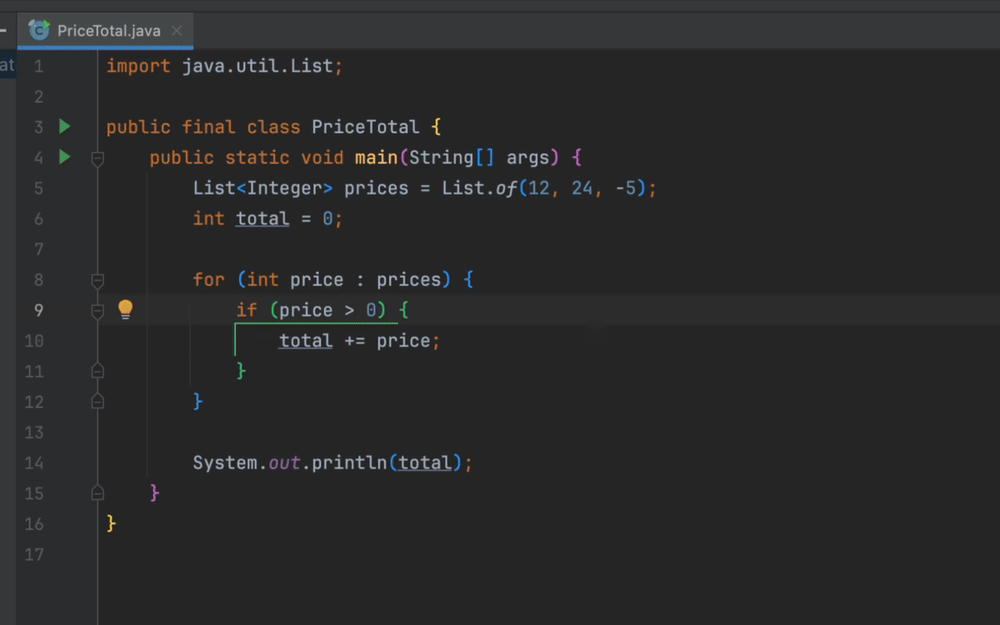
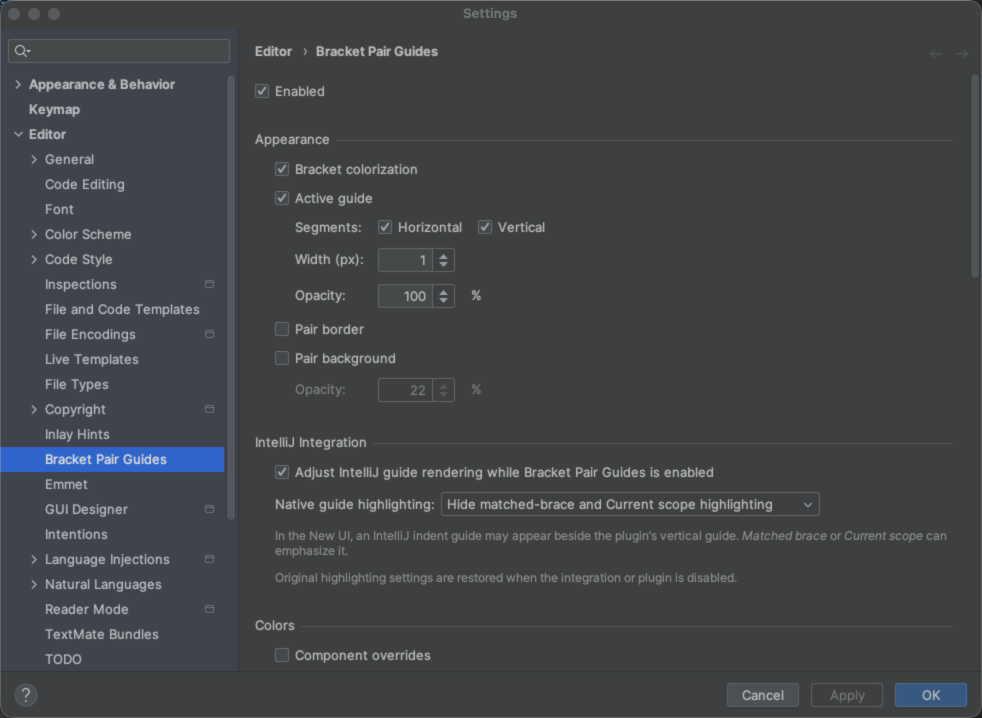

# Bracket Pair Guides

VS Code-style bracket pair guides for JetBrains IDEs.

Bracket Pair Guides builds a complete path around the bracket pair enclosing
the caret using horizontal and vertical guide segments. It combines the active
guide with nesting-level colors without recoloring variables, tags, or the
surrounding scope.

## What it does

- **Connects the complete pair.** A horizontal segment joins a single-line
  pair. For a multiline pair, one vertical segment connects the opening and
  closing arms.
- **Tracks the caret.** The guide follows the innermost recognized bracket pair
  enclosing the primary caret, not only a brace at the caret boundary.
- **Indicates nesting depth.** Matching opening and closing tokens share one of
  six repeating, customizable colors.
- **Preserves syntax highlighting.** Bracket colors and guides are added
  without recoloring variables, tags, or the surrounding scope.

## Customization

In **Settings | Editor | Bracket Pair Guides**, you can configure:

- the six nesting colors;
- horizontal and vertical guide segments;
- guide width and opacity;
- optional border or background emphasis on the active endpoints;
- separate guide, border, and background colors.

## Language support

Bracket Pair Guides uses the bracket rules registered by installed JetBrains
language plugins, so each language is recognized according to its own syntax.

Requires IntelliJ Platform 2024.1 or newer. Support varies by IDE and language;
see the [complete compatibility matrix](docs/reference_language_support.md) for
verified products and known limitations.

## Privacy

Bracket Pair Guides does not collect telemetry, transmit source code, or make
network requests. All analysis and settings remain inside the IDE.

## More information

- [Configuration guide](docs/guide_configuration.md)
- [IDE, language support, and limitations](docs/reference_language_support.md)
- [Changelog](CHANGELOG.md)
- [Contributing](CONTRIBUTING.md)

Distributed under the [MIT License](LICENSE).

Bracket Pair Guides is an independent project and is not affiliated with
Microsoft. Visual Studio Code and VS Code are trademarks of Microsoft
Corporation.
