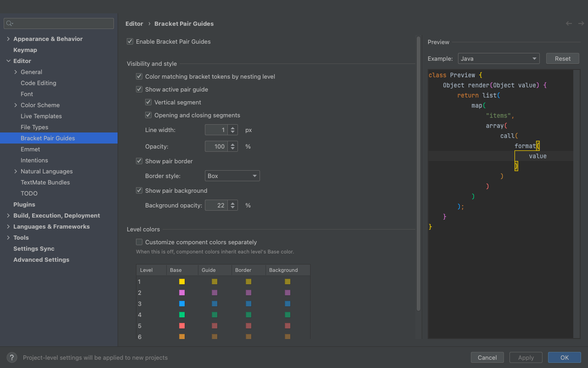
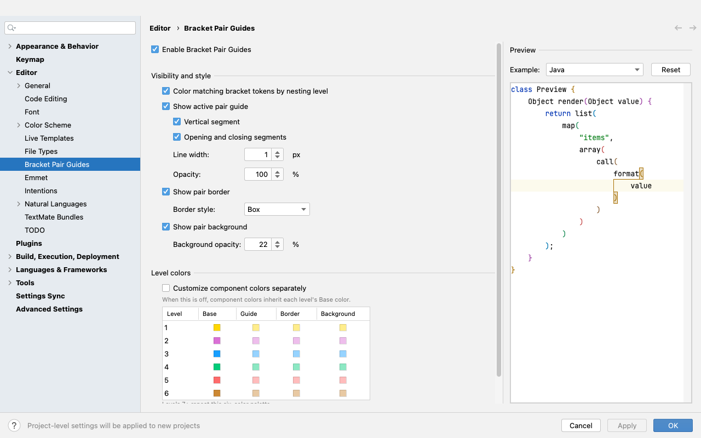

# Bracket Pair Guides

Colorizes matching brackets by nesting level and shows an active guide for the
innermost pair containing the caret.

## Preview

| Dark theme | Light theme |
|---|---|
|  |  |

## Features

- Six repeating nesting-level colors for matching bracket tokens.
- One caret-activated guide for the innermost containing pair.
- Optional border and background emphasis on the active opening and closing symbols.
- One Settings page for colors, guide geometry, active-pair styling, and an editable preview.
- Language-aware matching through the brace matchers registered by the IDE and language plugins.

## Requirements

- IntelliJ Platform 2024.1 or newer.
- A language or file type that provides a JetBrains brace matcher.

## Install a local build

1. Run `./gradlew buildPlugin`.
2. Open **Settings | Plugins** in the target IDE.
3. Select **Install Plugin from Disk** from the gear menu.
4. Choose the ZIP in `build/distributions/`.

Open **Settings | Editor | Bracket Pair Guides** to configure the plugin. See
[Configuration and conflict handling](docs/guide_configuration.md) for all
options and coexistence guidance.

## Develop and verify

```shell
./gradlew check
./gradlew buildPlugin
./gradlew verifyPlugin
./gradlew runIde
```

`runIde` opens a sandboxed IntelliJ IDEA instance with the plugin installed.
The regression suite covers Java, Kotlin, Kotlin script, JSON, XML, and
Markdown, including pinned real-world JetBrains source files and large inputs.

For implementation details, see
[Architecture and performance](docs/explanation_architecture.md).

## License

Copyright (c) 2026 sijun-yang. Distributed under the [MIT License](LICENSE).
