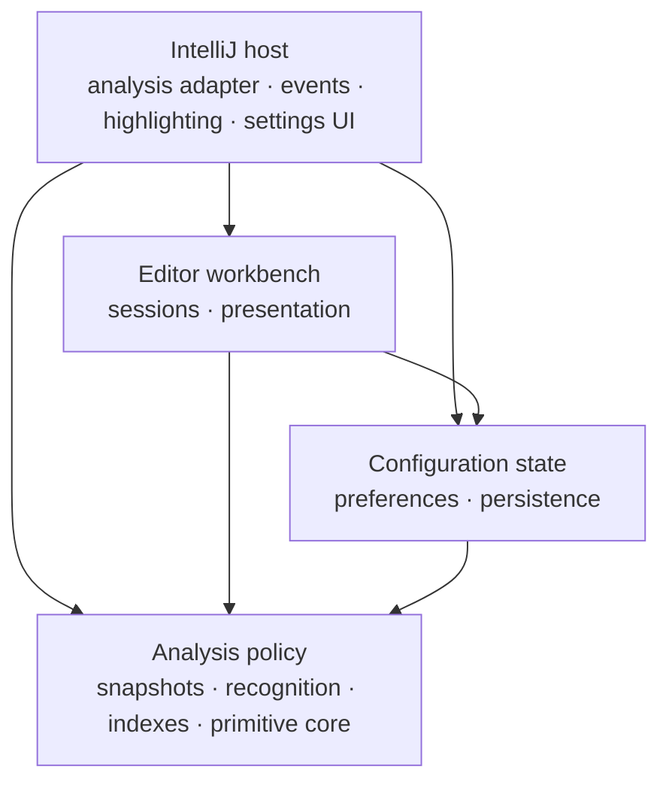

# Architecture

Bracket Pair Guides ships one production artifact from the `plugin` Gradle
module. Inside it, IntelliJ entry packages depend on analysis and presentation
policy through a one-way package graph. The `benchmarks` module is a JMH harness
that consumes compiled production classes but contributes no shipped code.

Structural knowledge is produced only by an IntelliJ highlighting pass. Editor
events consume an immutable accepted result and never run a brace matcher on the
event dispatch thread (EDT).

This document explains the current design. Exact capacity values and memory
layouts belong to the
[performance and capacity reference](reference_performance_limits.md). Naming,
responsibility, and test-boundary decisions are explained in the
[design report](explanation_design.md).

## Architecture at a glance

These are deliberately broad zones. Packages inside one zone may cooperate as
their implementation evolves, but dependencies between zones point inward and
package cycles remain forbidden. The executable and authoritative rules are in
[`ArchitectureTest.kt`](../plugin/src/test/kotlin/com/sijunyang/bracketpairguides/architecture/ArchitectureTest.kt).

The zones own these reasons to change:

| Zone | Packages | Responsibility |
|---|---|---|
| Policy | `analysis` except `analysis.intellij` | Inputs, outcomes, recognition, indexes, and primitive mechanisms |
| State | `preferences`, root `settings` | Immutable choices and IntelliJ persistence |
| Workbench | root `editor`, `presentation` | Per-editor acceptance, markers, drawing, and viewport state |
| Host | `analysis.intellij`, editor adapters, settings UI, compatibility | IntelliJ services, events, passes, and entry points |

## Runtime path

| Stage | Thread | Owner | Output |
|---|---|---|---|
| Invalidate | EDT or platform daemon | `EditorGuideEvents`, `GuideSettingsChange` | Release stale acceptance, synchronously refresh or remove tracked-pair geometry, and request background work |
| Collect | Highlighting read action | `BracketGuideHighlightingPass` | `AnalysisInput` and one cancellable analysis call |
| Recognize | Same background action | `BracketAnalysis`, `DocumentBrackets`, `PairingMachine` | Primitive pair table or a capacity refusal |
| Assemble | Same background action | `SnapshotAssembly` | `Complete`, `Limited`, or `Unavailable` |
| Publish | EDT | `EditorGuideSession`, `EditorAnalysisState` | One immutable acceptance per editor |
| Present | EDT and paint callback | `ActiveGuidePresentation`, `VisibleTokenDecorations` | Plugin-owned markers and highlighters |

Caret, viewport, theme, and appearance events take the short path through the
existing editor session. Every insertion, replacement, or deletion updates the
already tracked pair's endpoints and guide geometry in the same EDT event turn,
or removes presentation that cannot be made current within the bounded scan.
These events cannot discover a new pair. Third-party matcher callbacks occur
only in the cancellable background collection stage.

## IntelliJ composition boundary

`BracketAnalysis` is a final application-level light service. It composes the
installed-language catalog, document recognition, guide input, snapshot
assembly, cancellation, and revision-scoped index sharing. There is no service
interface or XML service descriptor: the repository has one implementation and
no external replacement point. `BracketGuidePassRegistration` resolves the
singleton service while creating each pass and supplies its `analyze` function
to that pass.

The service is intentionally IntelliJ-bound. `AnalysisInput` carries the actual
`Editor` and `FileType` because token meaning depends on the editor highlighter,
installed language extensions, document revision, file type, disabled language
families, and tab settings. Creating a platform-neutral copy of that model would
duplicate host semantics without another consumer.

Neutrality starts where it is useful. The Java classes in
`analysis.pairing.core` receive normalized token roles, matching rules,
cancellation, and an output sink. They know nothing about editors, services, or
IntelliJ. Active-pair, guide, token-index, and sorting policy are also protected
from IntelliJ dependencies by ArchUnit.

`BraceLanguageCatalog` is not a service. Recognition asks it for the definition
of a token language; Settings asks for its installed-family projection. These
are two queries over the same platform registry, not two independently managed
applications. A matcher that implements `BraceMatcher` keeps its contextual
behavior; a `PairedBraceMatcher` is adapted using the platform adapter.

There is no raw-character fallback, legacy file-type-only fallback, or
product-specific backend. If the IDE lacks `com.intellij.lang.braceMatcher`,
the compatibility startup boundary emits one **Unsupported IDE** notification.

## Outcome and snapshot boundary

Every attempted analysis has one authoritative outcome:

| Outcome | Meaning | Published data |
|---|---|---|
| `Complete` | Every requested facet is exact | A `BracketSnapshot` |
| `Limited` | Only the optional guide facet exceeded capacity | An exact lower-coverage snapshot and the attempted stamp |
| `Unavailable` | Recognition could not finish authoritatively | The attempted stamp and refusal reason; no capped prefix |

`AnalysisOutcome`, `AnalysisLimit`, `BracketSnapshot`, and `TokenWindow` live
together in `analysis.snapshot` because they change with result policy and query
shape. They are concrete internal types, not interfaces with one implementation.
The snapshot exposes active-pair, guide, and visible-token queries while hiding
assembly and index layout.

`AnalysisStamp` records the facts that make a result current. It includes the
document revision, highlighter identity, file type, requested coverage,
disabled language families, and guide-relevant tab settings. Apply rejects a
stale result as a unit. A completed stamp or a structural refusal prevents an
unchanged background retry loop; the host file-size predicate is rechecked
because saved or in-memory length can change independently.

## Index assembly and sharing

`AnalysisCoverage` becomes one `IndexLayout` before recognition.
`SnapshotAssembly` builds only the active-pair, token, and guide facets required
by that layout. It decides outcome and index policy without locating a service
or retaining a `ProgressIndicator`.

`DocumentGuidePositions` translates IntelliJ `Document` access into the line
data consumed by deterministic guide policy. The active-pair index returns the
innermost containing pair and resolves malformed crossing intervals
deterministically. Structural pairs may recover past unmatched regular openers;
regular pairs cannot cross a structural scope boundary.

`DocumentBracketIndexes` may canonicalize equivalent immutable payloads for the
same document revision and analysis identity. Hashes are prefilters only;
observable primitive content is compared before sharing. Weak references avoid
extending document or editor lifetime. Each split editor still owns its stamp,
active-pair memo, range markers, viewport, and markup.

This is result sharing, not single-flight recognition. Separate editor
highlighters are not assumed equivalent before their results are compared.

## Editor and presentation boundary

`BracketGuideHighlightingPass` checks IntelliJ's code-insight file-size policy,
collects in the daemon background lifecycle, and applies on the EDT. An
admission refusal still reaches apply so stale plugin markup can be cleared.

`EditorGuideSession` owns requested coverage, accepted analysis, lifecycle, and
viewport orchestration for one editor. `ActiveGuidePresentation` owns the
tracked pair, its range markers, its markup, and the invariant that endpoints
and guide geometry describe the same document revision. `VisibleTokenDecorations`
is separate because viewport coloring has a different state and invalidation
cadence.

On every document edit, `GuidePositionFallback` may scan bounded indentation
prefixes for the surviving tracked pair. It publishes exact current
geometry within that bound; otherwise the stale guide is removed immediately.
Equal pair offsets do not permit reuse because an equal-length space/tab
replacement can change the visual column. The fallback does not recognize
brackets, and authoritative background output replaces it. The exact bound is
defined in the
[performance reference](reference_performance_limits.md).

`BracketGuideDrawing` computes geometry with public editor APIs at paint time
and paints only inside the graphics clip. The plugin disposes only its own
highlighters; it never clears unrelated editor markup.

Persisted options live in `settings`; immutable choices live in `preferences`.
`GuideSettingsChange` requests reanalysis only for coverage or language changes.
Appearance-only changes update current presentation without recognition.

## Build-time boundaries

The plugin has no supported external API or committed ABI baseline. Kotlin
implementation remains `private` or `internal` by source-level design. The Java
pairing core is JVM-public because sibling packages and JMH compile against it;
that visibility is implementation access, not a compatibility promise.

ArchUnit 1.5.0 runs under JUnit 4 as part of `:plugin:check`. It analyzes compiled
Kotlin and Java production bytecode and enforces:

- the inward dependency direction between the four broad zones;
- absence of cycles between production package slices;
- absence of IntelliJ dependencies in the designated neutral policy packages;
- absence of analysis-type dependencies from editor event adapters;
- absence of event calls to methods that return analysis types.

This replaces the former custom source scanner. Package rules belong in the
test, where they run with behavior tests and inspect the bytecode that ships.
See [Contributing](../CONTRIBUTING.md#change-an-architecture-boundary) before
changing a boundary.

## Known limitations

- A structural edit that may alter later nesting requires full token recognition
  to discover a different pair; the currently tracked pair is still adjusted or
  removed synchronously.
- Only the primary caret selects an active pair.
- Complete active-scope background shading is intentionally absent.
- Folded endpoints are not painted.
- The highlighting pass does not traverse separate injected documents on its own.
- An executing third-party matcher callback cannot be forcibly interrupted.
- Split-editor payload sharing begins only after independently collected results
  are proved equivalent.
- Languages without `com.intellij.lang.braceMatcher` are not analyzed.
- Capacity boundaries may omit guides or make an analysis unavailable; the
  [performance reference](reference_performance_limits.md) is authoritative.

## Design sources

The package and test-boundary review used the following lectures from 즐거운
학습's Inflearn course *클린 코더스: 실전 객체 지향 프로그래밍과 TDD 마스터
클래스*. They informed the review criteria; they do not certify the result.

- [OOP](https://www.inflearn.com/courses/lecture?courseId=336905&unitId=279438)
- [TDD 1](https://www.inflearn.com/courses/lecture?courseId=336905&unitId=279445)
- [Architecture](https://www.inflearn.com/courses/lecture?courseId=336905&unitId=279449)
- [Architecture UseCase](https://www.inflearn.com/courses/lecture?courseId=336905&unitId=279450)
- [Single Responsibility Principle](https://www.inflearn.com/courses/lecture?courseId=336905&unitId=279452)
- [Dependency Inversion Principle](https://www.inflearn.com/courses/lecture?courseId=336905&unitId=279456)

Platform references:

- [JetBrains services](https://plugins.jetbrains.com/docs/intellij/plugin-services.html)
- [JetBrains brace matching](https://plugins.jetbrains.com/docs/intellij/additional-minor-features.html)
- [ArchUnit user guide](https://www.archunit.org/userguide/html/000_Index.html)
