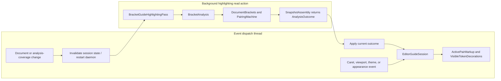

# Architecture

Bracket Pair Guides separates background bracket recognition from editor
decoration. Structural knowledge is produced only by an IntelliJ highlighting
pass; editor events consume an immutable accepted result and never run a brace
matcher synchronously.

This document explains the current design. Exact capacity values, memory
layouts, and complexity formulas belong to the
[performance and capacity reference](reference_performance_limits.md).

## Architecture at a glance

The runtime path is one-way. Each row names the module, thread, and state owner
at that step:

| Stage | Thread | Module and owner | State or output |
|---|---|---|---|
| Structural or coverage change | EDT/platform daemon | `plugin`: `EditorGuideEvents` or `GuideSettingsChange` | Invalidate per-editor analysis and schedule background work |
| Collect | Background highlighting read action | `plugin`: `BracketGuideHighlightingPass` | One `AnalysisInput`, attempted stamp, and cancellable collection |
| Recognize | Same background action | `engine`: `BracketAnalysis` → `DocumentBrackets.recognize()` → `PairingMachine` | Local matcher groups and pairing state become a primitive pair table |
| Assemble | Same background action | `engine`: `SnapshotAssembly.outcome()` | One immutable `Complete`, `Limited`, or `Unavailable` outcome |
| Publish | EDT | `plugin`: `EditorGuideSession.accept(AnalysisOutcome)` | `EditorAnalysisState` publishes one volatile immutable `AnalysisAcceptance` containing snapshot, completion, and refusal |
| Present and paint | EDT/paint callback | `plugin`: `TrackedBracketPair`, `ActivePairMarkup`, `VisibleTokenDecorations` | Per-editor markers and plugin-owned highlighters; paint owns no structural state |

Caret, viewport, theme, and appearance events take the short path through the
existing editor session. With no current snapshot, they may adjust already
tracked range markers, but they cannot discover a new pair. A background pass
uses `EditorGuideSessions.canSkipAnalysis` only to avoid repeating an already
published attempt; it does not mutate EDT-owned state.

The Gradle dependency direction is `plugin -> engine`; `benchmarks` also
depends on the compiled engine artifact for isolated JMH probes. Engine owns
analysis and immutable results, plugin owns editor lifetime and presentation,
and benchmarks own no production code. The engine artifact is composed into the
plugin's single JAR, so this build boundary adds no runtime classloader boundary.

`BracketAnalysis` is synchronous. It uses the pass-provided
`ProgressIndicator` and creates no executor or coroutine scope. Third-party
matcher callbacks are confined to this cancellable background path and are
never invoked by an EDT event.

Sharing stops at immutable analysis payloads. Each split editor retains its own
caret memo, range markers, viewport, and markup; shared indexes retain no
editor. Weak document generations prevent the canonical store from extending a
document or editor lifetime.

## Engine boundary

`BracketAnalysis` is the only operational plugin-to-engine entry point. It is
registered as a concrete IntelliJ Application Service and exposes two uses:

- analyze an `AnalysisInput` with a `ProgressIndicator`;
- list installed brace-matcher language families for Settings.

The facade deliberately remains IntelliJ-bound. `AnalysisInput` carries the
actual `Editor` and `FileType`, because token roles depend on the editor
highlighter, installed `LanguageBraceMatching` extensions, document revision,
file type, and tab settings. Neutral copies of those host concepts would form a
second, potentially inconsistent token model.

The policy core is neutral instead. Java code under
`analysis.pairing.core` uses only the Java standard library. A
`PairingMachine` receives normalized token roles, deterministic matching rules,
cancellation, and an output sink. It owns group-isolated stacks, malformed
recovery, nesting depth, and completed-pair ordering. It reads no editor,
document, clock, executor, service, or global state.

`DocumentBrackets` is the adapter between those boundaries. It reads the
editor's token stream and resolves only the token language's
`com.intellij.lang.braceMatcher` registration. A `PairedBraceMatcher` is
wrapped with the platform adapter; a matcher that already implements
`BraceMatcher` keeps its contextual behavior. The adapter emits explicit open,
close, toggle, strict-context, and structural roles for the neutral machine.

There is no raw-character fallback, legacy file-type-only matcher fallback, or
product-specific backend. Layered languages remain isolated, while comment and
string behavior follows the host lexer and matcher.

IDE compatibility is a separate startup boundary.
`IdeCompatibilityStartupActivity` checks that the required language brace
matching extension point exists, and `UnsupportedIdeWarning` owns the
application-wide once-only **Unsupported IDE** notification. It does not create
an alternate recognition path.

## Outcome boundary

Every analysis attempt returns one of three authoritative states:

| Outcome | Meaning | Published data |
|---|---|---|
| `Complete` | Every requested facet is exact | A `BracketSnapshot` |
| `Limited` | One optional facet exceeded its independent capacity | An exact lower-coverage snapshot plus the attempted stamp and limit |
| `Unavailable` | Authoritative recognition could not complete | The attempted stamp and limit; no snapshot or capped prefix |

Only guide capacity can produce `Limited`: token and active-pair indexes stay
exact while the guide is omitted. File-size, completed-pair, and pending-open
admission failures produce `Unavailable`.

`AnalysisStamp` records the facts that make a result current: document
identity and revision, highlighter-dependent semantics, file type, requested
coverage, disabled matcher families, and guide-relevant tab settings. A stale
pass is rejected as a unit. Completed stamps and engine-capacity refusals
prevent an unchanged request from entering a background retry loop. The IDE
file-size predicate is rechecked on every pass because the saved or in-memory
length can change independently of the analysis stamp.

`BracketSnapshot` exposes queries for the active pair, guide, and visible token
window. It does not expose assembly objects or concrete index implementations.

## Index assembly and sharing

`AnalysisCoverage` is compiled into one internal index layout before
recognition. `SnapshotAssembly` then builds only the active-pair, token, and
guide facets needed by that layout. Assembly order minimizes overlap between
temporary and retained primitive arrays; details belong to the
[performance and capacity reference](reference_performance_limits.md).

The active-pair index resolves crossing intervals deterministically and returns
the innermost containing pair. Malformed recovery honors each platform
`BracePair.isStructural` flag: structural pairs may recover past unmatched
regular openers, while regular pairs cannot cross a structural scope boundary.

`DocumentBracketIndexes` canonicalizes equivalent immutable payloads for the
same document revision and analysis identity. Content hashes are only
prefilters; equality compares the complete observable primitive content.
Token-only payloads do not retain the source pair table. Canonical entries use
weak document, file-type, pair-table, and index references, and a new document
revision replaces the previous generation.

This is result sharing, not global single-flight recognition. Two split editors
may independently collect results because their highlighters cannot be assumed
equivalent before comparison.

## Editor integration

`BracketGuideHighlighting` registers one `TextEditorHighlightingPass`.
Collection happens in the daemon's background read action and application
happens on the EDT. Before recognition, the pass delegates large-file admission
to IntelliJ's code-insight predicate. Unsaved content is checked using the
current document length; saved content uses the virtual file length.

The apply phase accepts a result only if its stamp still matches current
coverage, language selection, file type, document revision, and highlighter
semantics. An admission refusal still reaches the apply phase so stale
plugin-owned markup can be cleared.

`EditorGuideEvents` routes primary-caret, document, viewport, editor-lifetime,
and color-scheme events to the owning session. It never performs token
iteration. A document change releases stale proportional analysis structures;
existing `RangeMarker` presentation may remain coherent only for the previously
known pair while replacement analysis is pending.

When exact guide coverage is pending for an already tracked multiline pair,
`GuidePositionFallback` may inspect a bounded amount of leading whitespace to
keep the provisional drawing usable. It does not recognize brackets, and an
authoritative background guide always replaces it. The exact bound is recorded
in the [performance and capacity reference](reference_performance_limits.md).

## Rendering and settings

`BracketGuideDrawing` owns one guide's geometry and appearance. It resolves
visual coordinates with public editor APIs at paint time, paints only within
the current graphics clip, and performs no PSI work or read action.

The plugin retains and disposes only its own highlighters. It never removes all
editor highlighters or deletes markup by a shared layer number.

`BracketGuideSettingsPage` uses the platform `BoundConfigurable` lifecycle.
Persisted language choices are disabled matcher-family IDs rather than a static
allowlist, so an installed language plugin can add a supported family without a
Bracket Pair Guides release. A dialect inheriting its base matcher's capability
shares the same family ID.

`GuideSettingsChange` applies committed preferences to live sessions. It asks
the IntelliJ daemon for background reanalysis only when coverage or language
selection changes. Appearance-only changes update existing presentation and do
not invoke recognition.

## ABI boundary

Both Kotlin modules use explicit API mode. Implementation contracts stay
`private` or `internal`. The root `analysis` facade consumed across the module
boundary is public only for JVM linkage and is annotated
`@ApiStatus.Internal`; it is not a supported consumer API.

Committed ABI dumps are verified during each module's `check` task. The engine
package guard rejects public Kotlin ABI outside the root facade and rejects
implementation types leaking through that facade. The deployable plugin's ABI
dump remains empty. A separate engine check rejects `com.intellij` references
from `analysis.pairing.core`, making the neutral-core rule executable rather
than documentary. See [Contributing](../CONTRIBUTING.md#abi-changes) before
updating a baseline.

## Known limitations

- An edit that may alter later nesting requires a new full token recognition.
- Only the primary caret selects an active pair.
- Complete active-scope background shading is intentionally not provided.
- Folded endpoints are not painted.
- The host pass does not traverse separate injected documents on its own.
- An executing third-party matcher callback cannot be forcibly interrupted.
- In malformed input, an unmatched structural opener may conservatively hide a
  regular pair that would be valid only if that opener never closes.
- Split-editor result sharing starts after independently collected results are
  proved equivalent; transient analysis work is not shared.
- Languages without `com.intellij.lang.braceMatcher` are not analyzed, and a
  legacy `com.intellij.braceMatcher` registration alone is insufficient.
- Capacity boundaries may omit guides or make an analysis unavailable. Current
  values and exact fallback behavior are defined only in the
  [performance and capacity reference](reference_performance_limits.md).

## Related documentation

- [Performance and capacity reference](reference_performance_limits.md)
- [IDE and language support reference](reference_language_support.md)
- [Configuration and conflict handling](guide_configuration.md)
- [Run the performance benchmarks](../benchmarks/guide_benchmarking.md)
- [Contributing](../CONTRIBUTING.md)

The historical
[object-design](explanation_object_design.md) and
[test-boundary](explanation_test_boundaries.md) reports record completed
refactoring work. They are evidence for past decisions, not current onboarding
or the source of current limits.

## Platform references

- [Syntax and error highlighting](https://plugins.jetbrains.com/docs/intellij/syntax-highlighting-and-error-highlighting.html)
- [Brace matching](https://plugins.jetbrains.com/docs/intellij/additional-minor-features.html)
- [Services](https://plugins.jetbrains.com/docs/intellij/plugin-services.html)
- [Disposer and plugin unload](https://plugins.jetbrains.com/docs/intellij/disposers.html)
- [Color scheme management](https://plugins.jetbrains.com/docs/intellij/color-scheme-management.html)
