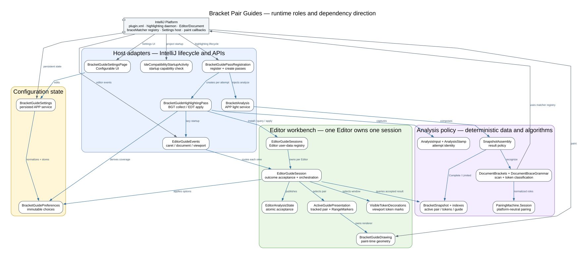
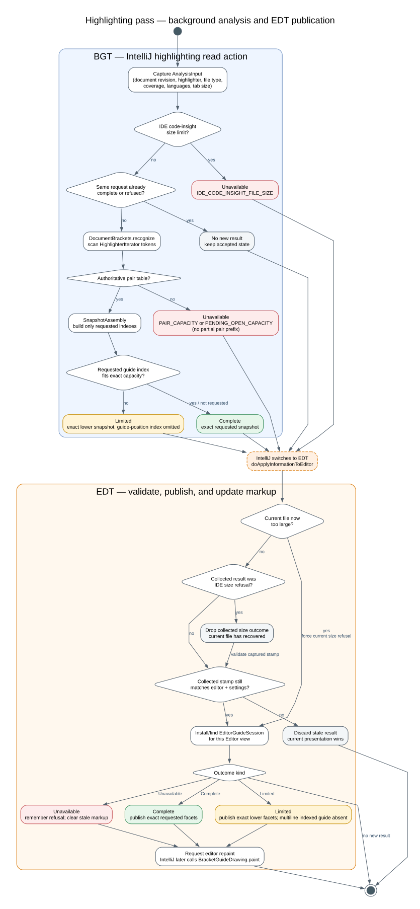
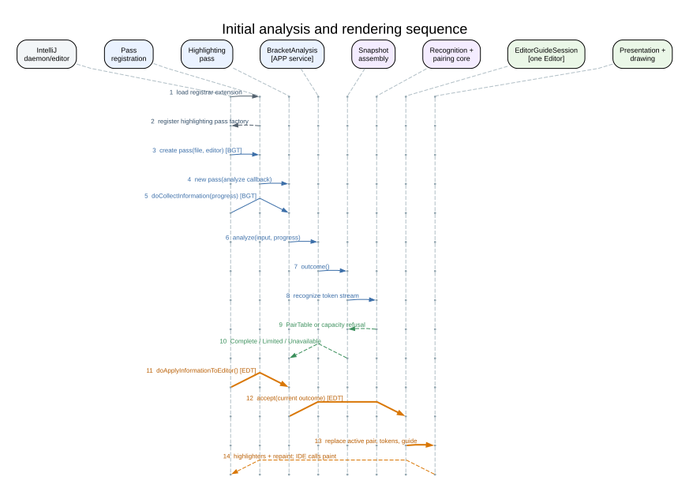
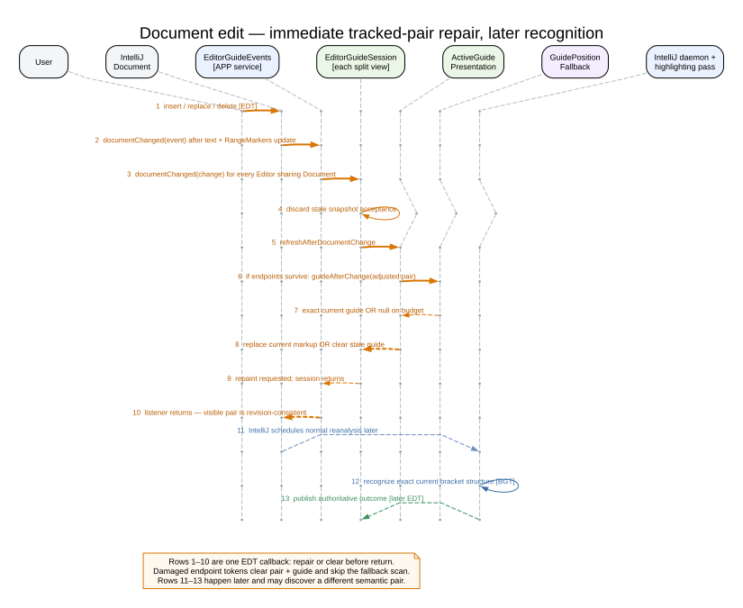

# IntelliJ plugin runtime walkthrough

Bracket Pair Guides에는 일반 애플리케이션의 `main()`이 없습니다. IntelliJ가
`plugin.xml`을 읽고, 필요한 시점에 extension·service·UI를 생성한 뒤 정해진
callback을 호출합니다. 플러그인은 그 callback 안에서 분석 결과와 editor별
표시 상태만 소유합니다.

이 문서는 IntelliJ 플러그인을 처음 보는 개발자가 실제 실행 순서와 각 객체의
책임을 따라가기 위한 설명입니다. 패키지 의존 규칙과 설계 근거는
[Architecture](explanation_architecture.md), 정확한 용량 제한은
[Performance and capacity reference](reference_performance_limits.md)를 참고하세요.

## 먼저 알아야 할 세 가지

1. **IntelliJ가 실행 주체입니다.** 플러그인이 자체 event loop나 executor를
   시작하지 않습니다.
2. **분석과 표시는 다른 스레드 단계입니다.** 괄호 인식은 highlighting
   background read action에서, editor markup 변경은 EDT에서 수행합니다.
3. **`Document`와 `Editor`는 다릅니다.** split editor는 텍스트 `Document`를
   공유하지만 caret, tab size, viewport, session과 markup은 각 `Editor`가
   따로 소유합니다.

## IntelliJ가 발견하는 진입점

[`plugin.xml`](../plugin/src/main/resources/META-INF/plugin.xml)은 다음 metadata를
등록합니다. 이 항목들은 하나의 직렬 초기화 과정이 아니라 서로 독립적인
진입점입니다.

| 진입점 | IntelliJ가 호출하는 때 | 이 플러그인의 작업 |
|---|---|---|
| `postStartupActivity` | project startup 이후 | `braceMatcher` extension point가 없는 IDE인지 확인하고 오류 알림 표시 |
| `highlightingPassFactory` | project daemon이 highlighting pass를 등록·생성할 때 | 실제 괄호 분석과 표시 경로 시작 |
| `applicationConfigurable` | 사용자가 Settings 페이지를 열 때 | 설정 UI 생성과 Apply 처리 |
| `applicationService` | 저장된 설정이 처음 필요할 때 | `bracket-pair-guides.xml` 로드·저장 |

두 application light service는 XML에 선언되지 않습니다.

- [`BracketAnalysis`](../plugin/src/main/kotlin/com/sijunyang/bracketpairguides/analysis/intellij/BracketAnalysis.kt)는 첫 pass 생성 시 `service<BracketAnalysis>()`로 lazy lookup됩니다.
- [`EditorGuideEvents`](../plugin/src/main/kotlin/com/sijunyang/bracketpairguides/editor/events/EditorGuideEvents.kt)는 첫 editor session 설치 시 lazy lookup되고 전역 editor listener를 연결합니다.

`DumbAware`는 indexing 중에도 extension을 사용할 수 있다는 뜻입니다.
background thread에서 실행된다는 뜻은 아닙니다.

## 전체 역할과 의존 방향

[DOT source](diagrams/runtime_roles.dot)

회색 화살표는 IntelliJ 경계를 넘는 호출 방향입니다. 대부분은 플랫폼 callback이고,
matcher registry처럼 플러그인이 플랫폼 API를 호출하는 방향도 있습니다. 파란
화살표는 플러그인 내부의 의존 또는 데이터 흐름입니다. 내부 의존은 host
adapter에서 editor workbench와 analysis policy 쪽으로 향합니다. 이 방향은
[`ArchitectureTest`](../plugin/src/test/kotlin/com/sijunyang/bracketpairguides/architecture/ArchitectureTest.kt)가
compiled bytecode에서 검사합니다.

수명 기준으로 보면 다음과 같습니다.

- **APP**: `BracketAnalysis`, `EditorGuideEvents`, `BracketGuideSettings`
- **PROJECT/registration**: `BracketGuidePassRegistration`
- **PASS**: `BracketGuideHighlightingPass` 한 분석 시도
- **EDITOR**: `EditorGuideSession`과 plugin-owned markup
- **ANALYSIS RESULT**: immutable `BracketSnapshot`
- **PAINT CALL**: `BracketGuideDrawing.paint()` 한 번

## 백그라운드 분석 순서도

[DOT source](diagrams/background_analysis_flow.dot)

### Collect 단계

IntelliJ daemon은
[`BracketGuidePassRegistration`](../plugin/src/main/kotlin/com/sijunyang/bracketpairguides/editor/highlighting/BracketGuidePassRegistration.kt)에서
editor/file별 pass를 만들고,
[`doCollectInformation`](../plugin/src/main/kotlin/com/sijunyang/bracketpairguides/editor/highlighting/BracketGuideHighlightingPass.kt)을
background highlighting read action에서 실행합니다.

1. `AnalysisInput`이 현재 editor, file type, 요청 coverage와 비활성 언어를 묶습니다.
2. `AnalysisStamp`가 document revision, highlighter identity, file type, tab size와
   설정 identity를 고정합니다.
3. IDE의 code-insight file-size 정책과 이미 수락된 동일 요청인지 확인합니다.
4. 필요한 경우 `BracketAnalysis.analyze()`를 같은 background call stack에서
   동기 실행합니다.

플러그인 전용 executor는 없습니다. IntelliJ가 pass 예약, read action과
`ProgressIndicator` cancellation을 소유합니다.

### Recognize와 assemble 단계

분석 service는 다음 객체를 한 시도에 조립합니다.

1. [`DocumentBrackets`](../plugin/src/main/kotlin/com/sijunyang/bracketpairguides/analysis/pairing/DocumentBrackets.kt)가 `EditorHighlighter`의 token iterator를 순회합니다. 정상 완료 시 끝까지 읽고, cancellation이나 구조 용량 제한이면 즉시 중단합니다.
2. [`DocumentBraceGrammar`](../plugin/src/main/kotlin/com/sijunyang/bracketpairguides/analysis/pairing/DocumentBraceGrammar.kt)가 각 token language의 IntelliJ `BraceMatcher`를 조회하고 OPEN·CLOSE·TOGGLE, group, XML context와 structural role로 정규화합니다.
3. [`PairingMachine.Session`](../plugin/src/main/java/com/sijunyang/bracketpairguides/analysis/pairing/core/PairingMachine.java)이 플랫폼을 모르는 stack state로 pair를 만듭니다.
4. [`SnapshotAssembly`](../plugin/src/main/kotlin/com/sijunyang/bracketpairguides/analysis/snapshot/SnapshotAssembly.kt)가 설정에서 요구한 active-pair, token, guide index만 구성합니다.
5. 같은 `Document` revision에서 독립적으로 완성된 index payload는 primitive 내용까지 같을 때만 공유할 수 있습니다. 이것은 결과 공유이지 single-flight 분석이 아닙니다.

결과는 세 종류뿐입니다.

| Outcome | 의미 | Session에 전달되는 것 |
|---|---|---|
| `Complete` | 요청한 facet이 모두 정확함 | 정확한 `BracketSnapshot` |
| `Limited` | optional guide-position index만 용량을 넘음 | guide-position coverage를 제외한 정확한 lower snapshot |
| `Unavailable` | authoritative recognition을 완료할 수 없음 | stamp와 거부 사유, snapshot 없음 |

Cancellation은 네 번째 outcome이 아닙니다. `ProcessCanceledException`이 그대로
전파되어 아무 결과도 publish하지 않습니다. Pair capacity를 넘은 prefix도
partial snapshot으로 노출하지 않습니다.

### Apply 단계

IntelliJ는 collect가 끝난 뒤
[`doApplyInformationToEditor`](../plugin/src/main/kotlin/com/sijunyang/bracketpairguides/editor/highlighting/BracketGuideHighlightingPass.kt)을
EDT에서 호출합니다.

1. 현재 file size와 `AnalysisStamp`를 다시 확인합니다.
2. 편집이나 설정 변경으로 stale해진 결과는 버립니다.
3. editor별 `EditorGuideSession`을 설치하거나 찾습니다.
4. `session.accept(outcome)` 하나의 경계로 결과를 전달합니다.
5. session이 active pair, visible token과 guide markup을 교체하고 repaint를 요청합니다.

## 최초 렌더링 시퀀스

[DOT source](diagrams/initial_render_sequence.dot)

회색 1–2는 project의 highlighting registrar가 extension을 발견하고 pass factory를
등록하는 단계입니다. 특정 UI thread 계약으로 간주하지 않습니다. 파란색 3–10은
daemon의 non-EDT pass 생성·background collect 구간이고, 주황색 11–14는 EDT
apply 구간입니다. `BracketGuideHighlightingPass`가 두 실행 구간을 연결하지만,
background에서 editor markup을 변경하지는 않습니다.

마지막 `repaint()`가 선을 직접 그리는 것도 아닙니다. IntelliJ의 editor paint가
나중에 [`BracketGuideDrawing.paint()`](../plugin/src/main/kotlin/com/sijunyang/bracketpairguides/presentation/BracketGuideDrawing.kt)를
호출합니다. Drawing은 저장된 pixel 좌표 대신 그 순간의 zoom, folding, soft wrap,
logical/visual position을 사용합니다.

## 문서 편집 시퀀스

[DOT source](diagrams/document_edit_sequence.dot)

주황색 1–10은 하나의 정상 EDT `DocumentListener` callback 안에서 끝납니다.

1. IntelliJ가 text와 `RangeMarker` 위치를 먼저 갱신합니다.
2. `EditorGuideEvents`가 같은 `Document`를 보는 모든 `Editor`를 찾습니다.
3. 각 editor의 `EditorGuideSession`이 stale snapshot acceptance를 버립니다.
4. endpoint token이 손상되었으면 현재 pair와 guide를 즉시 제거합니다.
5. pair가 살아 있으면 guide를 현재 revision에 맞춥니다. 멀티라인 guide가 필요하고 pair 내부가 바뀐 경우에만 해당 editor의 tab size로 bounded exact indentation scan을 수행합니다. 동일 라인, guide 비활성화, pair 밖 편집은 scan하지 않거나 기존 column을 안전하게 재사용합니다.
6. 현재 geometry를 증명하지 못하면 오래된 guide를 즉시 제거합니다.
7. callback이 반환될 때 pair endpoint와 guide geometry는 같은 document revision을 나타냅니다.

파란색·초록색 11–13은 IntelliJ가 나중에 예약하는 daemon pass입니다. 현재
추적 중인 pair의 표시 보정은 즉시 수행하지만, **다른 semantic pair의 발견**은
이 background 경로에서만 수행합니다. 따라서 document event에서 third-party
`BraceMatcher`를 호출해 UI를 막지 않습니다.

## 주요 객체의 책임

| 객체 | 수명·스레드 | 소유하는 책임 |
|---|---|---|
| `BracketGuidePassRegistration` | project registration / BGT 생성 경로 | highlighting pass 등록, pass에 analysis 함수 조립 |
| `BracketGuideHighlightingPass` | pass별 / BGT collect + EDT apply | 입력 capture, admission, staleness 재검증, outcome 전달 |
| `BracketAnalysis` | APP singleton / BGT 호출 | recognition, guide input, snapshot 조립과 weak result sharing 연결 |
| `AnalysisInput`·`AnalysisStamp` | 분석 시도별 immutable value | 한 결과가 유효한 editor revision과 설정 identity |
| `BraceLanguageCatalog` | APP analysis owner 내부 / platform lookup | 설치된 `braceMatcher` definition과 Settings용 language-family projection |
| `DocumentBrackets` | 분석 시도별 / BGT | highlighter token stream 순회와 cancellation·capacity 조기 중단 |
| `DocumentBraceGrammar` | 분석 시도별 / BGT | IntelliJ matcher semantics를 normalized token role로 변환 |
| `PairingMachine.Session` | scan별 / BGT | group stack, malformed recovery와 completed pair 생성 |
| `PairCollection` | scan별 / BGT | completed pair를 bounded primitive `PairTable`로 축적 |
| `SnapshotAssembly` | 분석 시도별 / BGT | coverage별 index 구성 순서와 outcome 결정 |
| `IndexLayout`·세 index | 분석 결과별 / BGT build | active-pair, viewport token, guide-position query 구조 |
| `DocumentBracketIndexes` | APP service 내부 weak cache / BGT | 같은 document revision의 동등한 immutable payload canonicalization |
| `BracketSnapshot` | immutable result | caret active-pair, pair guide, viewport token query |
| `EditorGuideSessions` | APP registry / EDT mutation | `Editor.userData`에 editor별 session 설치·조회·폐기 |
| `EditorAnalysisState` | editor별 / EDT publish, BGT read | snapshot·completion·refusal을 하나의 atomic acceptance로 저장 |
| `EditorGuideSession` | editor별 / EDT | outcome 수락, caret·viewport·설정 변화와 presentation 수명 조정 |
| `TrackedBracketPair` | editor별 / EDT | pair와 guide anchor를 `RangeMarker`로 편집에 따라 추적 |
| `ActiveGuidePresentation` | editor별 / EDT | 현재 pair와 guide가 같은 revision을 나타내도록 replace·repair·clear |
| `GuidePositionFallback` | document edit callback / EDT | 현재 tracked pair의 geometry를 bounded scan으로 즉시 증명하거나 거부 |
| `VisibleTokenDecorations` | editor별 / EDT | viewport 인근 bracket token highlighter의 bounded window |
| `ActivePairMarkup` | editor별 / EDT | active endpoints와 guide `RangeHighlighter` 자원 |
| `BracketGuideDrawing` | guide highlighter별 / paint callback | 현재 visual geometry 계산과 선 그리기 |
| `EditorGuideEvents` | APP singleton / EDT 전달 | caret, document, viewport, theme와 editor lifecycle을 session으로 라우팅 |
| `BracketGuideSettings` | APP persisted service | normalized immutable preferences의 XML 저장 |
| `BracketGuideSettingsPage` | Settings UI 인스턴스 / EDT | IntelliJ UI DSL binding과 Apply 시 변화 전달 |
| `GuideSettingsChange`·`DaemonRefresh` | Settings Apply / EDT | live session 갱신과 필요한 경우 daemon 재분석 요청 |
| `IdeCompatibilityStartupActivity` | project startup | 필수 extension point 부재를 한 번 명시적으로 알림 |

## Settings Apply는 어떻게 동작하는가

Settings UI는 값을 `BracketGuideSettings`에 반영한 뒤
[`GuideSettingsChange`](../plugin/src/main/kotlin/com/sijunyang/bracketpairguides/editor/events/GuideSettingsChange.kt)를
만듭니다.

- 색상·opacity 같은 appearance-only 변경은 live session의 현재 markup만 갱신합니다.
- language gate나 필요한 analysis facet이 바뀌면 live session을 갱신하고
  [`DaemonRefresh`](../plugin/src/main/kotlin/com/sijunyang/bracketpairguides/editor/events/DaemonRefresh.kt)가
  열린 project의 code-analysis daemon 재실행을 요청합니다.
- 일반 document 편집은 이 객체가 daemon을 재시작하지 않습니다. IntelliJ daemon이
  자체 lifecycle로 새 pass를 예약합니다.

## IntelliJ 용어 대응표

| IntelliJ 용어 | 이 프로젝트에서의 의미 |
|---|---|
| Extension point | IDE가 특정 lifecycle에 플러그인 객체를 끼우는 등록 지점 |
| Application service | IDE process 전체에서 공유되는 lazy singleton |
| Configurable | Settings 창의 한 페이지와 Apply/Reset lifecycle |
| Highlighting pass | daemon이 파일/editor 분석을 collect하고 EDT에서 apply하는 작업 |
| EDT | UI, editor state, markup을 변경하는 단일 event-dispatch thread |
| BGT read action | PSI/document를 일관되게 읽는 취소 가능한 background 작업 |
| `Document` | 공유 가능한 text model; split editor가 같은 객체를 볼 수 있음 |
| `Editor` | caret, viewport, tab setting과 markup을 가진 하나의 view |
| `RangeMarker` | document edit에 따라 offset이 이동하는 논리적 위치 |
| `RangeHighlighter` | editor markup model이 관리하는 강조 자원 |
| Custom renderer | highlighter를 paint할 때 IDE가 호출하는 drawing callback |

## 코드를 읽는 권장 순서

1. [`plugin.xml`](../plugin/src/main/resources/META-INF/plugin.xml)
2. [`BracketGuidePassRegistration`](../plugin/src/main/kotlin/com/sijunyang/bracketpairguides/editor/highlighting/BracketGuidePassRegistration.kt)
3. [`BracketGuideHighlightingPass`](../plugin/src/main/kotlin/com/sijunyang/bracketpairguides/editor/highlighting/BracketGuideHighlightingPass.kt)
4. [`BracketAnalysis`](../plugin/src/main/kotlin/com/sijunyang/bracketpairguides/analysis/intellij/BracketAnalysis.kt)
5. [`DocumentBrackets`](../plugin/src/main/kotlin/com/sijunyang/bracketpairguides/analysis/pairing/DocumentBrackets.kt), [`DocumentBraceGrammar`](../plugin/src/main/kotlin/com/sijunyang/bracketpairguides/analysis/pairing/DocumentBraceGrammar.kt), [`PairingMachine`](../plugin/src/main/java/com/sijunyang/bracketpairguides/analysis/pairing/core/PairingMachine.java)
6. [`SnapshotAssembly`](../plugin/src/main/kotlin/com/sijunyang/bracketpairguides/analysis/snapshot/SnapshotAssembly.kt)과 [`AnalysisOutcome`](../plugin/src/main/kotlin/com/sijunyang/bracketpairguides/analysis/snapshot/AnalysisOutcome.kt)
7. [`EditorGuideSession`](../plugin/src/main/kotlin/com/sijunyang/bracketpairguides/editor/EditorGuideSession.kt)
8. [`ActiveGuidePresentation`](../plugin/src/main/kotlin/com/sijunyang/bracketpairguides/presentation/ActiveGuidePresentation.kt)과 [`BracketGuideDrawing`](../plugin/src/main/kotlin/com/sijunyang/bracketpairguides/presentation/BracketGuideDrawing.kt)
9. [`EditorGuideEvents`](../plugin/src/main/kotlin/com/sijunyang/bracketpairguides/editor/events/EditorGuideEvents.kt)와 [`BracketGuideSettingsPage`](../plugin/src/main/kotlin/com/sijunyang/bracketpairguides/settings/ui/BracketGuideSettingsPage.kt)

이 순서로 읽으면 플랫폼 진입점, background 분석, immutable 결과, EDT 표시,
짧은 editor-event 경로가 차례로 연결됩니다.
