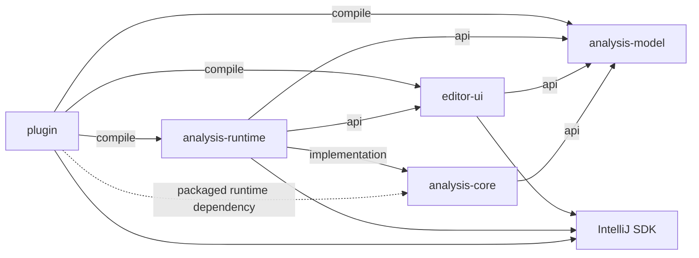
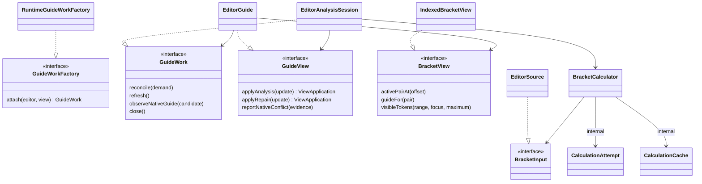

# Module architecture

The five production modules separate ownership through compiler dependencies. Presentation can request work and read immutable results, but its compiler cannot resolve the calculation core or runtime implementation. The modules also hide decisions: a caller requests a complete use case instead of assembling pairing, capture, indexes, or worker cancellation.

## Physical ownership

| Module and package root | Owns | Direct production project dependencies |
|---|---|---|
| `analysis-model`, `model` | Platform-free values, coverage, refusals, `BracketView`, and `TokenWindow` | None |
| `analysis-core`, `core` | Complete calculation attempts, unrelated-write retry, pairing, indexes, guides, repair, and weak canonical storage | `analysis-model` (`api`) |
| `editor-ui`, `ui` | Presentation policy, geometry, markup, settings, SDK event adapters, and the work/view contracts its callers need | `analysis-model` (`api`) |
| `analysis-runtime`, `runtime` | SDK input, work lifetime, source validity, accepted results, native proof, and final EDT approval | `analysis-model`, `editor-ui` (`api`); `analysis-core` (`implementation`) |
| `plugin`, `plugin` | Composition, descriptor registration, highlighting-pass adapters, and packaging | `analysis-model`, `editor-ui`, `analysis-runtime` (`implementation`) |

All package roots share the prefix `com.sijunyang.bracketpairguides`. Model and core compile and test without IntelliJ. UI, runtime, and plugin use the IntelliJ SDK.

A runtime dependency is not necessarily a compile dependency. Gradle packages core transitively through runtime, while runtime's `implementation` declaration keeps core off the plugin compiler's classpath. The plugin archive needs all five owner jars; UI still cannot compile a direct core or runtime reference. Runtime and UI owner jars remain ordinary libraries in `lib/`, compatible with the classic plugin descriptor. Packaging does not grant a source module permission to import another owner.

## Contracts belong to their clients

`ui.work` defines `GuideWorkFactory`, `GuideWork`, `GuideDemand`, and `GuideView` because presentation determines the work it needs and how updates are applied. Runtime implements those contracts and imports no other UI implementation package. Plugin supplies the implementation at composition. `InstalledBraceLanguages` is another UI-owned contract; the runtime supplies language-capability facts while UI owns settings presentation.

Core defines `BracketInput`, `LineInput`, and `CalculationControl` because calculation determines which bounded facts and cancellation operations it needs. `EditorSource` implements these contracts with SDK reads. The pure test and benchmark adapters implement the same input contracts without IntelliJ.

`model.result.BracketView` exposes result queries without revealing builders or proportional storage. Core's `IndexedBracketView` implements it. Source identity stays private to runtime; model values do not carry opaque host objects or stamps.

`BracketCalculator.analyze` and `repair` are the core's deep facade. Their interface includes bounded input, cancellation, refusal, source validation, and reuse rules, not just method signatures. The public final class hides the implementation without a redundant calculator/default-calculator pair. Pairing sessions, index builders, sorting, and guide scanning remain internal decisions. Kotlin algorithm declarations are `internal`; Java helpers are package-private. These visibility choices complement the physical dependency graph rather than replacing it.

`EditorGuide` similarly hides tracked markers, token windows, active geometry, and reentrant rendering behind the UI-owned view contract. `EditorAnalysisSession` hides accepted-result state and the ordering of work revocation/replacement behind one desired-state reconciliation operation. Callers do not sequence cancel, capture, compute, and publish.

## Where a feature belongs

| Change | Start in | Keep out of callers |
|---|---|---|
| Pair recognition, recovery, depth, or index lookup | `core.internal`, exercised through `core.api.BracketCalculator` | Pairing sessions and concrete indexes |
| Guide indentation, repair admission, or canonical reuse | `core.internal` | Prefix scan loops and cache entry protocols |
| Language classification or matcher interaction | `runtime.capture` and `runtime.capture.matcher` | SDK tokens, iterators, and grammar objects in model/core |
| Read-action scheduling, source checks, task cancellation, accepted-result authority | `runtime.capture`, `runtime.session` | Jobs and host stamps in UI |
| Surface support, focus, visibility, settings, or notification episodes | `ui.policy`, `ui.editor`, `ui.settings` | Presentation decisions in core/runtime |
| Markup ownership, immediate hiding, token-window reuse, or reentrant effects | `ui.presentation`, `ui.editor.EditorGuide` | Document analysis in paint/event callbacks |
| Native brace proof | `runtime.nativeproof`; its interest/evidence contract is in `ui.work` | Native traversal in paint callbacks |
| Registration, startup, or module wiring | `plugin.GuidePlugin`, pass registration, and `META-INF/plugin.xml` | Core references in plugin composition |

## What the dependency graph proves

The production module audit inspects actual Kotlin/Java compiler inputs, dependency visibility, source roots, and destinations. Negative compile probes require forbidden Kotlin and Java references to fail; positive controls ensure the symbols exist. Repository policy also rejects paths or shared outputs that would reopen access, and checks runtime bytecode references against the UI-owned contract package.

Those checks establish structural restrictions when executed successfully. They do not prove algorithm correctness, timely cancellation, freedom from listener reentrancy, or correct IDE packaging. Pure contracts, real SDK execution, lifecycle and visual checks, packaging/compatibility checks, and performance measurements supply separate evidence. Their execution status belongs in the validation records, not in this architecture explanation.

See [Analysis execution](explanation_analysis_execution.md), [Editor presentation policy](explanation_editor_presentation_policy.md), and the project [glossary](../GLOSSARY.md).
