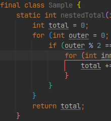
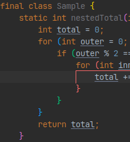
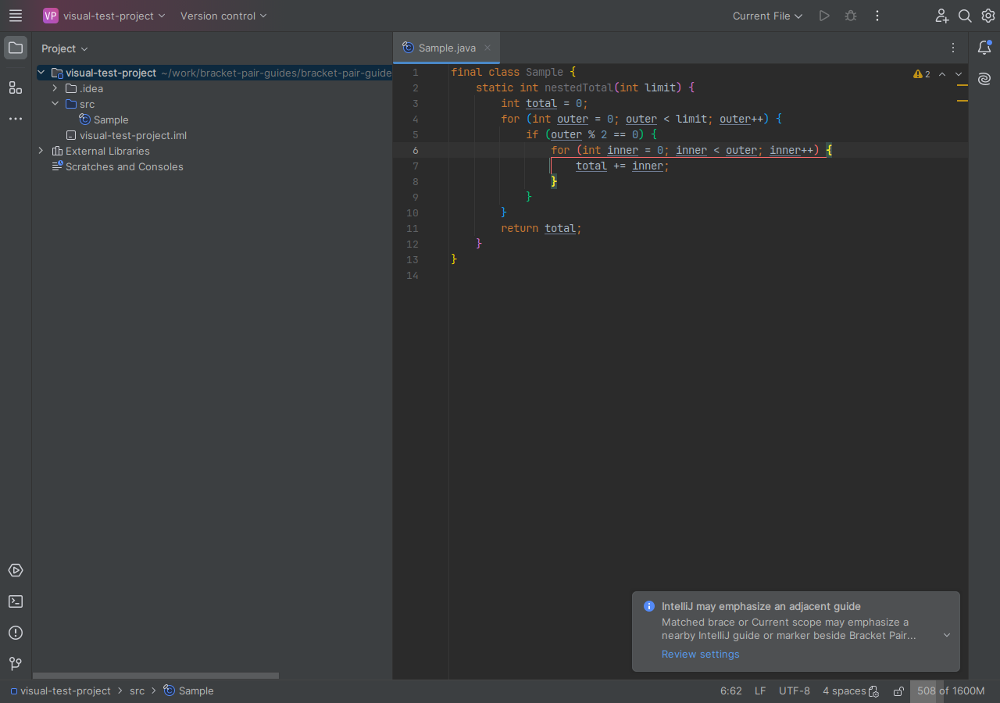
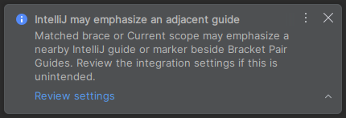
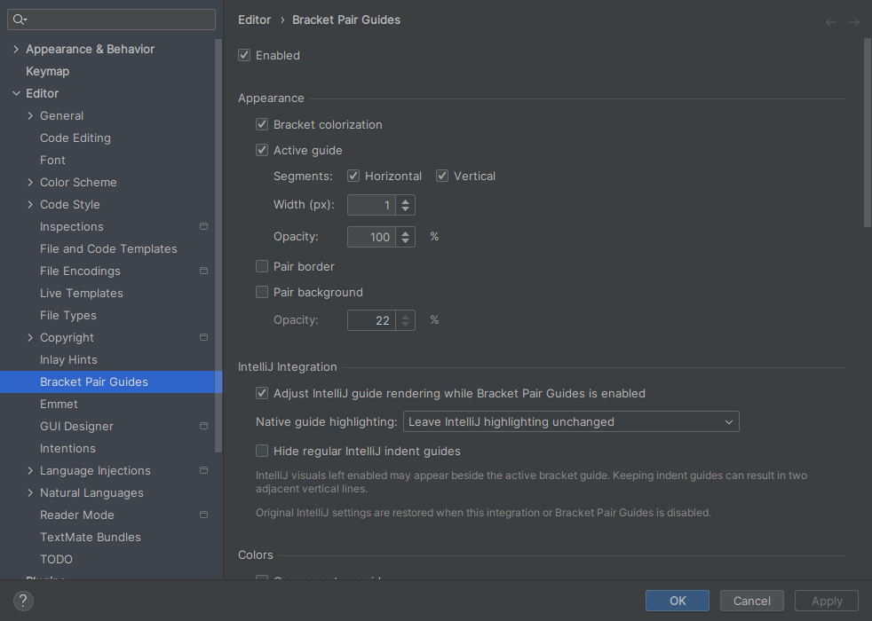

# Configure Bracket Pair Guides

All behavior and appearance settings are under **Settings | Editor | Bracket
Pair Guides**. There is no separate Color Scheme page.

## Choose what is shown

| Setting | Default | Effect |
|---|---:|---|
| Enabled | On | Enables or disables all plugin highlighting |
| Bracket colorization | On | Colors both symbols of every matched pair |
| Active guide | On | Shows a guide for the innermost pair containing the primary caret |
| Vertical | On | Shows the vertical part of a multiline guide |
| Horizontal | On | Shows opening/closing arms and single-line guides |
| Width (px) | 1 | Sets the guide width from 1 to 4 pixels |
| Opacity | 100% | Sets guide opacity from 10% to 100% |
| Pair border | Off | Adds a border to the two active symbols |
| Pair background | Off | Adds a background to the two active symbols |
| Background opacity | 22% when enabled | Blends the pair color with the editor background |

The plugin does not shade the complete range between the active symbols.
Moving the caret outside every pair removes the active guide and symbol
emphasis; nesting-level token colors remain visible when enabled.
The default active presentation uses only the vertical and horizontal guide
segments. Enable either pair option when the two active symbols need additional
emphasis.

Use the **IntelliJ Integration** group to control native emphasis and the
physical indent-guide lines that can appear beside a multiline active guide.

## Adjust IntelliJ guide rendering

Open **Settings | Editor | Bracket Pair Guides**, then find the **IntelliJ
Integration** group. The three controls work together as follows:

| Setting | Default | Effect |
|---|---:|---|
| Adjust IntelliJ guide rendering while Bracket Pair Guides is enabled | On | Applies the selected native highlighting and indent-guide choices |
| Native guide highlighting | Hide matched-brace and Current scope highlighting | Controls whether IntelliJ can emphasize an existing native indent guide |
| Hide regular IntelliJ indent guides | Off | Removes the physical native indent-guide lines when enabled |

**Matched brace** and **Current scope** are IntelliJ checkboxes under
**Settings | Editor | General | Highlight on Caret Movement**. **Current scope**
is not a separate vertical-line option. In the New UI, both settings can change
the color or prominence of an existing indent guide. The physical line itself
is controlled by **Show indent guides** under
**Settings | Editor | General | Appearance**.

The default keeps useful regular IntelliJ indent guides. In the New UI, a dim
native indent guide can therefore remain beside the plugin's active vertical
guide. This is expected and does not indicate that suppression failed.

To show only the plugin guide in the New UI code area:

1. Keep **Adjust IntelliJ guide rendering while Bracket Pair Guides is enabled**
   selected.
2. Select **Hide matched-brace and Current scope highlighting**.
3. Select **Hide regular IntelliJ indent guides**.

This option changes IntelliJ's global indent-guide value. An editor with an
explicit per-editor override can continue to show indent guides; the plugin
detects that effective value but does not overwrite the override.

Hiding native highlighting and hiding regular indent guides solve different
problems. With **Show indent guides** enabled, its physical line can sit beside
the plugin guide. **Matched brace** and **Current scope** only emphasize that
existing line in the New UI; they do not add another physical line. The regular
guide remains dim when its highlighting is suppressed. In the Classic UI,
native brace highlighting can instead paint a gutter-side marker even when
regular indent guides are hidden. Use the default highlighting mode, not only
the indent-guide option, when native emphasis should be removed in both UIs.

Compare the resulting New UI editor states at the same caret position:

| IntelliJ emphasis enabled | Default suppression | Plugin guide only |
|---|---|---|
|  |  |  |

In the first state, **Show indent guides** supplies the adjacent physical line;
native highlighting only emphasizes it. That emphasis triggers the advisory
notification. The middle state is the default, which keeps the same regular
line dim. The final state also selects **Hide regular IntelliJ indent guides**.

Choose a highlighting mode according to the native behavior you want:

- **Hide matched-brace and Current scope highlighting** suppresses both rendered
  effects by disabling IntelliJ's matched-brace processing. This is the default.
- **Hide Current scope highlighting only** keeps matched-brace feedback and
  suppresses Current scope. At a brace boundary, matched-brace highlighting can
  still emphasize the native guide.
- **Leave IntelliJ highlighting unchanged** does not take ownership of either
  native highlighting setting.

Clear the parent option to stop managing all three native settings temporarily.
The selected mode and indent-guide option are retained but disabled in the UI,
and any native values currently owned by the plugin are restored. Disabling
Bracket Pair Guides has the same restoration effect.

The plugin remembers each IntelliJ value before changing it. It restores that
exact value when the integration or plugin is disabled, the selected option no
longer needs it, the plugin is unloaded, or the IDE exits. If a managed IntelliJ
value is explicitly turned back on elsewhere, that newer choice wins: the
plugin releases only that value, keeps the parent integration enabled, and
updates the corresponding child selection. Re-enabling matched-brace or Current
scope highlighting selects **Leave IntelliJ highlighting unchanged**;
re-enabling indent guides clears **Hide regular IntelliJ indent guides**.

Because these IntelliJ settings are Boolean values, another component writing
`false` while the plugin already owns the same `false` value cannot be detected
as a separate change. The plugin retains its recorded original value in that
case and restores it when ownership ends.

Native-setting management and native-emphasis notifications initially apply
only to standard local editors. Remote Development, Code With Me, and other
client-backed editor paths are left unchanged.

### Respond to the native-emphasis notification

Bracket Pair Guides can show one informational balloon after it displays a
multiline active vertical guide and detects that **Matched brace** or **Current
scope** can visibly emphasize an existing IntelliJ indent guide beside it in the
New UI, or a gutter-side marker in the Classic UI. Select **Review settings** to
open the **IntelliJ Integration** group and choose the intended combination.

The notification appears in the lower-right corner of the IDE:

Expand it to read the complete explanation and select **Review settings**:

The action opens the relevant settings page without changing the current
selection:

The notification is advisory. Opening or closing it does not change plugin or
IntelliJ settings. It is published only once across IDE processes and projects.
Regular dim indent guides are useful under the default configuration and never
trigger this notification, so the absence of a notification does not mean that
only one physical line will be shown.

## Choose languages

The **Languages** group is at the bottom of the settings page. It lists every
installed language family that provides either a language brace matcher or a
language-backed legacy file-type brace matcher. This includes embedded-only
languages without a standalone file type. Every family is enabled by default.

- Clear a family to exclude it from token colors, active guides, and pair
  emphasis.
- Use **Select All** or **Deselect All** to change every currently installed
  family at once, then adjust individual families as needed.
- Derived languages that inherit the same matcher are grouped together. For
  example, TypeScript and JSX can appear in the JavaScript family tooltip.
- A newly installed supported family starts enabled. A disabled selection is
  retained if its language plugin is temporarily removed.
- **Custom file types** means syntax-table bracket tokens registered through
  the platform `TEXT` matcher. Plain text also uses matcher-defined standard
  bracket tokens; arbitrary raw characters are not scanned.

Applying a language change clears stale decorations in every live editor session
and schedules complete background analysis. Editors and split views do not run
matcher callbacks synchronously; each waits for its background pass to publish a
current snapshot. Reopen the Settings page after installing a language plugin so
the family list can be rediscovered.

Only matcher-defined pairs are affected. Enabling YAML does not turn indentation
blocks into bracket pairs. Languages backed only by the legacy file-type
extension are included when their file type is language-backed. See the
[IDE and language support reference](reference_language_support.md).

## Set level colors

The **Colors** grid contains six levels. Deeper levels repeat the same sequence:
level 7 uses level 1, level 8 uses level 2, and so on. The selectors are the
IntelliJ Platform's standard color controls.

Every level starts with an explicit built-in Base color. These values are the
applied palette, not placeholders that resolve through the active editor theme.
By default, Base supplies the bracket-token foreground, guide line, pair border,
and pair background for that level.

Enable **Component overrides** only when Guide, Border, or Background should
differ from Base. While the switch is off, those three columns remain visible
but read-only and Base is applied to all components. Turning the switch on makes
the saved component colors editable. Turning it off retains them for later use.
**Reset colors** restores the built-in palette in all four columns and turns
component overrides off.

## Map familiar settings

| VS Code setting | Bracket Pair Guides setting |
|---|---|
| `editor.bracketPairColorization.enabled` | Bracket colorization |
| `editor.guides.bracketPairs: "active"` | Active guide |
| `editor.guides.bracketPairsHorizontal: "active"` | Horizontal |
| `editor.guides.highlightActiveBracketPair` | Pair border / Pair background |
| `editorBracketHighlight.foreground1..6` | Base colors |
| `editorBracketPairGuide.activeBackground1..6` | Guide colors with Component overrides enabled |

## Use with other highlighting plugins

Bracket Pair Guides does not reserve a higher rendering priority than other
plugins. When multiple plugins draw colors, backgrounds, borders, or guides on
the same editor elements, one plugin can partially cover another. The result
depends on the layers and components used by each plugin, so there is no single
ordering that works for every combination.

Use the plugins together when the combined appearance is acceptable. Otherwise,
disable overlapping features or disable one of the plugins.

Bracket Pair Guides removes only highlighters it created and never clears an
editor's markup model. It changes only the native values selected in the
**IntelliJ Integration** group and restores values it still owns.

Language support follows the matcher selected by IntelliJ's brace-matching
resolver, not the IDE product name. The resolver can select either a token
language matcher or a legacy file-type matcher. An IDE can still load the plugin
while its primary language remains unsupported; for example, load compatibility
with CLion does not imply C/C++ recognition.

Related JetBrains documentation:

- [Customize editor appearance](https://www.jetbrains.com/help/idea/customize-editor.html)
- [Indent guides](https://www.jetbrains.com/help/idea/indentation.html)
- [Brace matching extension](https://plugins.jetbrains.com/docs/intellij/additional-minor-features.html)
- [Plugin compatibility](https://plugins.jetbrains.com/docs/intellij/plugin-compatibility.html)
