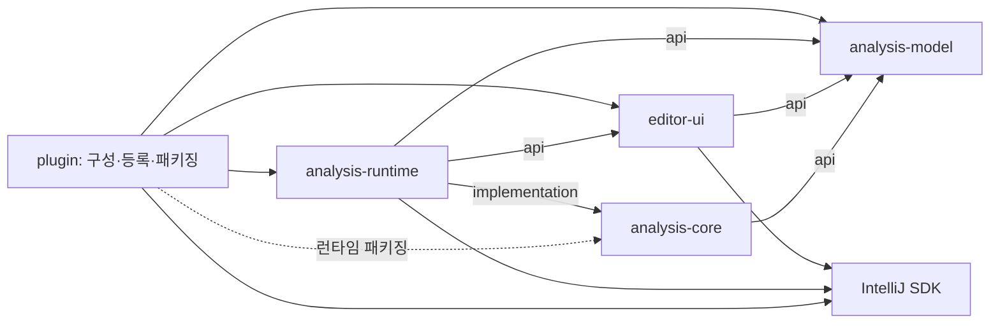
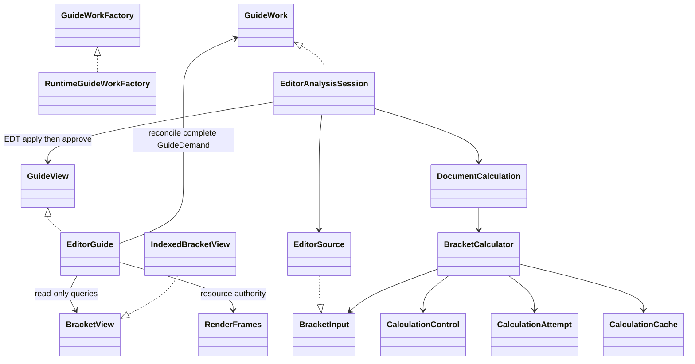

# 이슈 #97 재설계 구현·검증 보고서 — 초안

**초안입니다. 최종 검증과 성능 판정은 아직 완료되지 않았습니다.** 아래 결과는 각각의 기록에 고정된 소스에 대한 관측이며, 후속 수정에 자동으로 승계하지 않습니다. 마지막 검증된 커밋은 `be4f6201556710d2dc3f4895e7555f55fa9a8727`이며, 이후 listener/session 소유권 수정 3파일은 적용했지만 재검증 전입니다. final-check05의 source manifest는 `9d2af2e3ebd59bb709f10776165fc8b16fd69ba14ed247e11a2a025cfb002e68`입니다. 첫 공식 IDE matrix는 아래와 같이 실패·미완료이며 새 전체 matrix와 정식 성능은 대기 중입니다. 이전 check05/Qodana03/Driver11 결과를 이 3파일 수정의 통과로 자동 승계하지 않습니다.

## 구현 구조

다섯 프로덕션 모듈이 컴파일 의존성으로 책임을 나눕니다. UI는 작업의 완전한 희망 상태를 전달하고 읽기 전용 결과만 조회합니다. SDK 입력 수집, 계산 호출, 작업 취소 순서와 최종 결과 승인은 runtime이 맡습니다.

| 변경 책임 | 소유 모듈·주요 코드 | 호출자가 몰라도 되는 결정 |
|---|---|---|
| 플랫폼 없는 값·조회 계약 | model: `BracketView`, `TokenWindow`, `AnalysisResult` | 구체 인덱스와 저장 배열 |
| 괄호 대응·가이드·repair | core: `BracketCalculator`, `CalculationAttempt`, `CalculationCache` | builder, 정렬, 재시도와 약한 canonical 저장 |
| 표시·편집기 이벤트·설정 | UI: `EditorGuide`, `ActiveGuidePresentation`, `RenderFrames` | runtime jobs와 source stamp |
| SDK 수집·실행·유효성·승인 | runtime: `EditorSource`, `EditorAnalysisSession`, `DocumentCalculation` | full/repair/native 취소·교체 순서 |
| 모듈 연결·IDE 등록 | plugin: `GuidePlugin`, highlighting-pass adapters | core 계산 진입점 |

`GuideWorkFactory`, `GuideWork`, `GuideDemand`, `GuideView`는 소비자인 UI의 `ui.work` 계약입니다. `BracketInput`, `LineInput`, `CalculationControl`은 소비자인 core의 입력 계약입니다. model/core에는 IntelliJ 객체와 source stamp가 없습니다. runtime은 UI의 구현 패키지를 참조하지 않습니다.

UI에서 core/runtime의 계산·capture·builder·구체 인덱스를 직접 참조할 수 없고, plugin에서도 core를 직접 컴파일 참조할 수 없습니다. 최종 플러그인에는 필요한 다섯 owner jar가 포함되어야 하므로, 컴파일 차단과 패키징은 별도 검증합니다.

## 보존한 실행·표시 계약

- 문서 변경 콜백에서 영향을 받는 가이드를 동기적으로 숨긴 뒤 하나의 typed demand와 repair intent를 제출합니다. repair는 secondary full 작업의 75ms 지연과 독립적입니다.
- 계산은 독립 worker에서 시작하고 SDK 입력만 bounded read로 수집합니다. core가 한 계산 attempt와 unrelated-write retry를 소유합니다. lexer·extension callback 하나의 실행 시간까지 선점하지는 못합니다.
- runtime이 source, demand, ticket, lifetime을 확인하고 EDT에 적용합니다. 적용 후 재검증과 최종 승인을 수행하며 SDK 호출을 lifecycle lock 안에서 실행하지 않습니다.
- `RenderFrames`는 재진입한 새 렌더링의 리소스를 옛 rollback이 지우지 않도록 ownership을 관리합니다. 동일 pair·style의 실제 endpoint와 tracking marker는 재사용합니다.
- hidden/no-facet/close는 accepted 결과와 UI view를 해제합니다. close는 publication 권한을 즉시 취소하고 실행 중 capture의 local 참조는 작업이 unwind한 뒤 해제됩니다.
- native proof의 유효성은 runtime, 알림 episode·억제·사용자 설정은 UI가 소유합니다. ADR 0001/0002의 표시 및 쓰기 응답성 결정을 유지합니다.

## 현재 확인된 검증

기존 구현 세부사항 중심 테스트를 새 핵심 계약 테스트로 교체했습니다. 아래 각 행은 해당 기록의 소스 manifest에 고정된 개별 결과입니다. 서로 다른 실행의 통과를 현재 listener 수정 소스의 일괄 통과로 합산하지 않습니다.

| 검증 | 관측 결과 | 근거 |
|---|---|---|
| 컴파일 경계 TestKit | 32개 PASS, 실패·오류·skip 0 | [check05 집계](final-check-05/summary.json) |
| 패키징 검증 TestKit | 9개 PASS, 실패·오류·skip 0 | [check05 집계](final-check-05/summary.json) |
| BMF 보고·gate 계약 | 9개 PASS, 실패·오류·skip 0 | [check05 집계](final-check-05/summary.json) |
| 소스 단위 계약 | 55개 PASS: model4/core41/UI3/runtime3/plugin4 | [check05 집계](final-check-05/summary.json) |
| 실제 minimum SDK 계약 | 29개 PASS, 실패·오류·skip 0 | [check05 집계](final-check-05/summary.json) |
| root check 03 | 전체 FAILED: SDK 측정 harness 컴파일 실패 | [원본 로그](full-check-03/check.log) |
| 후속 SDK harness 컴파일 | PASS | [컴파일 로그](final-check-04/harness-compile.log) |
| SDK 없는 model/core 독립 fresh build | PASS45, 14 tasks executed; check05 선택 소스·빌드 파일과 정확 일치 | [fresh 로그](final-check-04/pure.log), [동일성](final-check-05/pure-source-parity.json) |
| Driver compare06 | 해당 소스의 12개 실제 PNG가 검토된 baseline과 바이트 동일; 정확 ARGB 비교 PASS | [검증 기록](driver/compare-06/verification.json) |
| 후속 Driver compare07 | FAILED: horizontal-only의 569픽셀 차이, bbox (48,4)..(111,33); 다른 11개 정확 일치 | [원본 로그](driver/compare-07/gradle.log) |
| Driver compare09 | FAILED: horizontal-only 30초 readiness timeout; 지연된 JDK 28,125파일 indexing이 실제 로그에 기록됨 | [setup 실패 원본](driver/compare-09/plugin/build/visual-test-artifacts/horizontal-only-daemon-observed.txt) |
| 표준 초기 index 준비 보완 후 Driver compare10 | FAILED: 모든 기능 assertion은 통과했으나 native 두 이미지 각2,218픽셀·edit20픽셀의 기존 oracle 불일치 | [픽셀 기록](driver/compare-10/pixel-comparison.json) |
| 독립 baseline counterfactual01 | 변경 없는 production072533f + 동일12scenario에서 기능 assertions 통과; candidate10과12개 모두ARGB·PNG바이트 정확 일치. old-golden 통과가 아닌 진단 capture | [교차 비교](driver/baseline-counterfactual-01/cross-production-comparison.json) |
| 의도적 settled oracle 정정 | 독립 baseline 실제 이미지로 3개만 정정, 기존 3개 보존; 9개 불변·정확 픽셀 기준 불변 | [독립 검토](driver/settled-oracle-review/review.json) |
| 정정 후 Driver compare11 | 기능 assertions 및 12개 정확 ARGB·PNG 일치 PASS | [원본 검증](driver/compare-11/verification.json) |
| Qodana03 | PASS: 기존 failThreshold0, 지적0건 | [검증 기록](qodana/run-03/summary.json) |
| 후속 root check04 | PASS134, SDK-free45, actual SDK29; 최신 Driver 보완 전 snapshot | [검증 기록](final-check-04/summary.json) |
| current SDK01 | PASS29, minimum과 동일 testcase; 실제IU263/JBR25 | [검증 기록](current-sdk-01/summary.json) |
| 최신 root check05 | exit0, 618.2745초, 134개 case·실패/오류/skip0, sourceUnchanged=true; 변경 없는 task 재사용 포함 | [실행 집계](final-check-05/summary.json) |
| paint-fill-removal mutation08 | 의도적 exit1·JUnit 실패1: 최종9개 pixel 비교가 제거를 검출, no-guide3개 정확 유지. 전체 테스트 통과가 아님 | [음성 대조군 검증](driver/mutation-08/verification.json) |
| 첫 공식13IDE matrix | FAILED exit1·1490.48초: IC5 strict PASS, IU4 같은 one-argument listener deprecated 실패, 나머지4 disk-guard NOT RUN. old be4f620/ZIP b1442ca6... 결과 | [원본 실행](compatibility/runs/20261008T115340939459Z/) |
| 지원 listener/session 소유권 수정 | 검토한 production3파일 patch 적용, 아직 재검증 전 | [정확 patch·검토](compatibility/document-listener-fix/session-ownership-review.md) |
| task-owned cache 정리 | task-created IDE3/installers3만 정리, pre-existing 삭제0, reports·제품 정보·해시 보존,23.34GiB회수 | [정리 기록](compatibility/owned-cache-retirement-01/) |
| 수정 후 source-check06·공식13IDE 전체 matrix | 대기; 기존 타깃 통과를 새 ZIP 결과로 재사용하지 않음 | [직렬 검증 절차](compatibility/README.md) |
| 정식 변경 전후 성능 비교 | 미실행 | smoke를 성능 통과로 취급하지 않음 |

컴파일 경계는 실제 Kotlin/Java compiler classpath, 전이 의존성, 공유 출력과 부정·긍정 compile probe를 확인합니다. 패키징은 owner 클래스·리소스·런타임 의존성의 별도 계약입니다. SDK 없는 빌드는 독립 `tools/pure-build`를 사용합니다. 기존 official Gradle Plugin Verifier, SDK runner, IntelliJ Driver, JMH/BMF 도구를 유지하며, 검증 실패와 원본 로그를 보존합니다.

SDK 29개 계약은 실제 worker/read/EDT publication, 중복 demand, source 변경·in-flight 취소, secondary repair 독립 실행, 실패·재진입 markup, XML 상태 roundtrip, hidden/disabled/close payload 해제, 동일 markup/marker 재사용, 같은 문서의 두 실제 편집기의 독립 publication과 close 수명을 포함합니다. 실제 IDE/JBR identity도 별도 확인합니다. headless 활동 입력은 명시적으로 주입하며 실제 Swing focus·visibility·Settings Apply와 paint는 Driver의 다른 증거입니다.

## 남은 한계와 최종 확인 항목

컴파일 차단은 잘못된 계층 참조를 막는 증거이며 모든 알고리즘·스레드 버그의 부재를 뜻하지 않습니다. `afterAdded`의 지원되는 재진입은 검증하지만, SDK가 금지한 `beforeRemoved` 중 nested marker 추가나 임의 listener 예외의 완전한 rollback까지 보장하지 않습니다.

unrelated-write retry는 core 입력 adapter에서 `RetryCapture`를 발생시키는 계약으로 검증합니다. 실제 SDK의 unrelated host write를 입력 chunk 사이에 배치해 전체 attempt 재시작을 결정적으로 확인하는 통합 계약은 아직 없습니다. 이를 SDK retry 통과로 취급하지 않습니다.

native A→B→A는 proof gate 단위 계약과 Driver의 실제 native settings/markup·pixels 관측으로 분리됩니다. 지연된 실제 native SDK traversal의 stale completion을 결정적으로 거절하는 통합 계약은 아직 없습니다. XML roundtrip은 실제 직렬화·재적재를 검증하며 별도 IDE 프로세스 재시작 시험을 대신하지 않습니다.

Driver compare07의 차이는 괄호·가이드 밖 `Contract`·`run` 식별자 영역이었습니다. compare09는 daemon 관측을 추가한 뒤, 초기 분석과 겹쳐 진행된 JDK 자동발견·root indexing으로 capture readiness가 실패했습니다. 표준 초기 프로젝트 준비 대기를 추가한 compare10에서는 horizontal-only가 기존 oracle과 정확 일치했습니다.

compare10의 나머지 세 oracle 차이는 독립 unchanged-production counterfactual에서도 동일하게 재현됐습니다. 두 native scenario에서는 이전 caret의 identifier-usage 배경이 사라졌고, 편집 후에는 SDK native indent guide가 갱신됐습니다. 모든 12개 baseline/candidate 영상이 정확 일치함을 확인하고 메인이 이미지를 독립 검토한 뒤 3개만 baseline production의 settled capture로 정정했습니다. 이전 이미지·실패 원본·검토 결정을 보존하며 정확 픽셀 기준은 변하지 않았습니다. counterfactual은 기존 oracle 통과가 아닙니다. 이후 compare11은 정정된 12개 oracle과 정확 일치했고 기능 assertions를 통과했습니다. Mutation08은 가이드 그리기를 제거한 격리 복사본에서 9개 시각 비교 실패를 의도대로 검출했습니다. 이는 mutation 테스트 전체 통과가 아닙니다.

정식 성능 비교는 아직 없습니다. 초기 SDK smoke에서 자동 startup에 의한 소유하지 않은 계산 가능성을 발견해 측정 전용 descriptor에서 양측의 자동 startup/pass만 제외하고 서비스는 유지하도록 격리했습니다. 모든 workload의 전후 attachment 검사와 실제 owned job/read·markup 관측이 필요합니다. 이 범위는 실제 plugin registration/lifecycle의 대체 증거가 아니며, 그것은 SDK·Driver·패키징·IDE 호환성 검증으로 따로 확인합니다. 이전 구현의 성능 결과도 재구현의 통과 증거로 승계하지 않습니다.

이전 root check05, Qodana03, Driver11과 음성 paint mutation08의 관측 결과는 해당 소스 증거로 보존합니다. 첫 공식 matrix의 deprecated listener 실패에 따라 지원되는 parent-disposable 등록과 session acquire/release 소유권을 적용했습니다. source-check06과 새 전체 공식13IDE matrix는 아직 대기 중입니다. 이 수정 후 동일 release ZIP·소스의 검증과 동조건 정식 성능·할당·retention 비교가 여전히 필요합니다. 원격 push, PR 생성, 병합 및 외부 업로드는 수행하지 않습니다.
