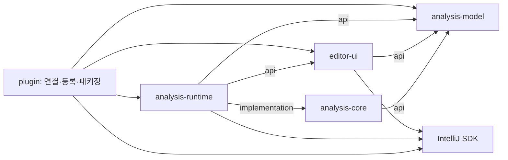
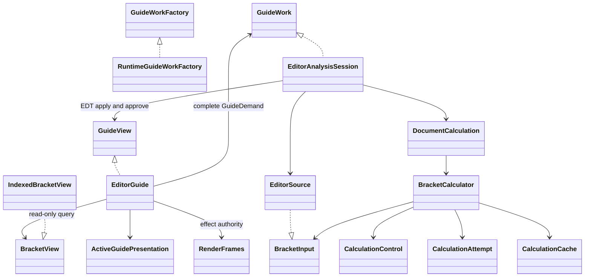

# 이슈 #97 재설계 구현·검증 보고서

**재구현과 계획된 로컬 검증 실행을 완료했습니다. 구조·동작 검증은 통과했고 성능 회귀는 남아 있습니다.** 검증 대상 구현 HEAD는 `8d853ea08d92150c127efe43d807771542ef84d6`, 생산 소스는 `f65ed4e`입니다. root 184개, SDK-free 51개, Qodana08, Driver13, strict 13 IDE, 정식 pure 60회·SDK 96회와 최종 raw BMF 변환을 검증했습니다. pure/SDK의 `performancePass`는 모두 `false`입니다.

승인된 [계획의 acceptance](approved-plan.html#acceptance)에 따라 추가 비용을 같은 조건에서 측정하고 미해결 신호를 별도로 보고합니다. 기존 Driver13/matrix03은 최종 release ZIP의 정확한 동일성으로 연결한 증거이며, 8d853ea에서 재실행한 것이 아닙니다. 과거 이력은 [ledger](verification-matrix.md)에서 추적합니다.

## 모듈과 공개 포트

다섯 프로덕션 모듈이 컴파일 의존성으로 책임을 나눕니다. 화살표는 compile 의존성입니다. runtime의 core 의존성은 implementation이므로 UI와 plugin으로 export되지 않습니다.

| 모듈 | 책임 | 공개 계약 |
|---|---|---|
| analysis-model | 플랫폼 없는 값·읽기 전용 결과 | BracketPair/BracketGuide/AnalysisCoverage, AnalysisResult, BracketView, TokenWindow |
| analysis-core | 괄호 대응·인덱스·가이드·repair, attempt/retry와 canonical 저장 | BracketCalculator, BracketInput/LineInput, CalculationControl, bounded immutable 입력 값 |
| editor-ui | 편집기 상태·이벤트·표시·설정과 작업 요청 | UI가 소유하는 GuideWorkFactory/GuideWork/GuideDemand/GuideView 및 연결용 UI 포트 |
| analysis-runtime | SDK 수집·bounded read·worker 실행·취소·유효성·결과 승인 | RuntimeGuideWorkFactory가 UI-owned GuideWorkFactory를 구현 |
| plugin | 서비스·startup/highlighting 등록·모듈 연결·배포 | IDE 등록과 구성 진입점; core 직접 컴파일 접근 없음 |

model/core는 IntelliJ SDK 없는 독립 `tools/pure-build` settings로 컴파일·테스트합니다. 이 진입점은 여섯 번째 프로덕션 모듈이 아니며 출력은 `tools/pure-build/build/<module>`로 분리됩니다.

## 코드의 책임과 실행 흐름

UI는 계산 입력을 수집하거나 core를 호출하지 않고 작업의 완전한 희망 상태를 전달합니다. runtime은 source/demand/ticket/lifetime을 확인한 뒤 EDT에 결과를 적용하며, 적용 후 재검증·최종 승인을 수행합니다. SDK 호출은 lifecycle lock 밖에서 실행합니다. model에는 SDK 객체나 source stamp가 없습니다.

문서 변경 콜백은 영향을 받는 가이드를 동기적으로 숨기고 repair intent를 제출합니다. repair는 secondary full 작업의 75ms 지연과 독립적입니다. 계산은 worker에서 시작하고 SDK 입력만 bounded read로 수집합니다. core가 attempt와 RetryCapture 재시도를 소유합니다. ADR0001/0002의 표시·쓰기 응답성 결정을 유지하며, lexer/extension callback 하나까지 선점 가능하다고 주장하지 않습니다.

RenderFrames는 재진입한 새 렌더링의 리소스를 이전 rollback이 제거하지 못하도록 소유권을 관리합니다. 최종 UI는 실제 geometry/style/tracked markers가 동일할 때만 presentation을 재사용하고 repaint·guideRevision·runtime 재조정을 유지합니다. prefix-only repair에서는 token adapter를 만들지 않으며 실제 첫 TOKENS read에서 지연 생성합니다. 실험 batch seam은 회귀 진단 후 제거했고 최종 core에는 남지 않습니다.

## 실제 접근 차단

실제 UI Kotlin/Java compiler classpath에는 core/runtime 구현이 없습니다. 결과 조회에는 model의 읽기 전용 계약을 사용합니다. plugin은 runtime을 연결하지만 core 계산 진입점·builder·구체 인덱스를 직접 컴파일 참조하지 못합니다.

[최종 fresh TestKit32개](final-check-10/xml/build-logic/test/TEST-com.sijunyang.buildlogic.CompilationBoundaryTest.xml)는 실제 Kotlin/Java compiler를 실행해 금지 symbol의 해당 probe 진단을 확인합니다. owner 긍정 대조군으로 symbol 자체가 사라져 생긴 거짓 성공을 배제합니다. unused dependency·전이 api export·공유 source/output·foreign friend·compiler/plugin 입력 등 우회 주입과 깨끗한 복원을 검사합니다. model/core의 SDK 직접 참조도 양 언어에서 실패해야 합니다. UI 테스트 classpath도 별도 실제 입력 정책을 적용합니다.

ArchUnit은 runtime→UI-owned work 이외 구현 접근, 외부→core internal, UI policy의 SDK/coroutine 유입 및 UI Job 소유를 보완 검사합니다. bytecode 규칙은 실제 classpath/negative compile 증명의 대체물이 아닙니다.

패키징은 별도 계약입니다. 최종 archive에는 승인된 five owner JARs만 포함되고, 실제 composed/instrumented task 입력·소유 클래스 바이트와 archive를 대조합니다. descriptor/등록·아이콘·필수 리소스, duplicate/test/SDK/runtime library 혼입을 검사합니다. 이번 451클래스는 관측값이며 고정 합격 수가 아닙니다.

## 완료한 로컬 검증

| 검증 | 현재 결과 | 근거 |
|---|---|---|
| root check/current SDK/release·visual build/plugin 구조 | 8d853ea에서 PASS184, 실패·오류·skip0, sourceUnchanged=true | [check10](final-check-10/summary.json);기존182 identities 보존+새BMF2 |
| SDK-free model/core | check10 fresh standalone rerun PASS51,SDK 없는 입력 guard PASS | [check10](final-check-10/summary.json) |
| 실제 minimum/current SDK | 각각 PASS35,check10 fresh XML | [check10 summary](final-check-10/summary.json), [fresh SDK XML](final-check-10/xml/plugin/) |
| Kotlin/Java 접근 경계·우회 주입 | fresh PASS32 | [check10 XML](final-check-10/xml/build-logic/test/TEST-com.sijunyang.buildlogic.CompilationBoundaryTest.xml) |
| 패키징·BMF 보고 정책 | packaging9+BMF11 PASS,archive byte guard PASS | [check10 XML](final-check-10/xml/build-logic/test/), [actual archive guard](final-check-10/module-verification/archive-identity.txt) |
| Qodana08 | PASS0findings/failThreshold0,exit0,sourceUnchanged=true,upload=false | [summary](qodana/run-08/summary.json) |
| Driver13 | PASS 기능 assertions·12 exact PNG/ARGB·추가 상호작용2,exit0,sourceUnchanged=true | [verification](driver/compare-13/verification.json), [production-equivalence](driver/compare-13/production-equivalence.json) |
| fresh strict13 IDE matrix03 | PASS13/13,8 failure levels 유지·동일 최종 ZIP/source | [matrix03 main review](compatibility/runs/20261008T184514375884Z/main-review.json) |
| pure02 |60실행·집계 완료;80metrics/7 >20%flags,performancePass=false | [main review](performance/pure-report-02/main-review.json) |
| SDK02 |96실행·raw감사·최종판정 완료;774metrics/40 >20%flags,performancePass=false | [main assessment](performance/sdk-report-02/main-assessment.json) |
| finalraw BMF |양측40cases/80metrics jqexact·cache저장/재사용·출력삭제후재실행PASS | [summary](performance/bmf-final-01/summary.json) |

최종 host release SHA256은 `3af98835450aaea492c213841fefc8c386c3435fabb6f2352d6484a0572ddc78`입니다. [artifact binding](final-check-10/existing-validation-artifact-binding.json)은 생산 소스·archive 동일성과 기존 Driver13/matrix03 증거의 재사용 범위를 확인합니다.

BMF exporter는 실제40cases·80metrics의 jq 동일성, configuration cache 저장·재사용·출력 삭제 후 재생성을 통과했습니다. 새 테스트2개는 원래 provider를 복원한 격리 음성 대조군에서 실패를 검출했습니다. 최종 pure02의 사전 고정 pair01 raw 변환도 통과했으며 성능 무회귀 판정과 별개입니다. 상세 실패·수정·대조군·fingerprint는 [BMF integration review](performance/bmf-integration-review.md)에 있습니다.

Driver13은 최종 소스를 Linux에서 재빌드했습니다. 451 production class와 descriptor·기타 resource 바이트가 host와 같고 plugin JAR MANIFEST의 Build-JVM/Build-OS만 다릅니다. 전체 ZIP 동일성은 주장하지 않으며 verifier에는 exact host release ZIP을 사용합니다. [차이 원본](driver/compare-13/host-driver-plugin-jar-differences.json)을 보존합니다.

184개는 model4/core47/UI4/runtime3/plugin4/minimum35/current35/build-logic52의 합계입니다. check10은 변경 없는 task의 정상 재사용을 포함하며, build-logic52와 양SDK35씩 XML은 이번 실행에서 생성됐습니다. 실제 최소/current SDK는 IC241.19416.15/JBR17 및 IU263.6259.32/JBR25의 identity 계약을 포함합니다.

SDK 계약은 실제 worker/read access/EDT publication, in-flight 취소·source 변화·stale 거절, repair·수명·payload 해제, 두 편집기의 독립 publication과 재진입 markup을 검증합니다. headless 활동 입력은 명시적으로 주입합니다. 실제 Swing focus/visibility·Settings Apply·paint는 Driver의 별도 증거로 구분합니다. 최종 matrix03은 동일 host ZIP으로13 IDE strict 검증을 새로 통과했습니다. minimum/current SDK도 각각35개 결과와 실제 IDE/JBR identity를 확인했습니다. SDK task 재사용은 기록하며13 IDE 전부의 GUI 실행을 뜻하지 않습니다. 이전 Driver12·matrix02 결과를 승계한 것이 아닙니다.

## 성능 판정 — 회귀가 남아 있음

정식 pure02의 60회와 SDK02의 96회 실행, raw 검증, 집계, 메인 판정과 독립 감사를 완료했습니다. source/compiled/JAR freeze를 유지했으며 실패 표본 제외·재시도·임계값 완화를 하지 않았습니다. **두 성능 판정은 모두 `false`입니다.** 기능·구조 검증 통과로 이를 상쇄하지 않습니다.

| 비교 | 집계와 반복 증가 | 핵심 잔존 비용 |
|---|---|---|
| pure02 | 80 metrics: 한 쌍 이상 증가 60, 6쌍 모두 증가 34, >20% flags 7 | sparse4096 full latency: cold 1.545배(+184045ns), reuse 1.522배(+181289ns), 각각 6/6 증가 |
| SDK02 | 774 metrics: 한 쌍 이상 증가 511, 6쌍 모두 증가 64, >20% flags 40 | 동일 caret callback: all 40→288B(+248B), latency 2.261배(+18.281us); tokens 0→128B, latency 1.941배(+4.844us), 모두 6/6 증가 |

[Pure 판정](performance/pure-report-02/main-review.json)·[독립 감사](performance/pure-report-02/independent-review.md), [SDK 판정](performance/sdk-report-02/main-assessment.json)·[독립 감사](performance/sdk-report-02/independent-review.md)에 모든 증가와 원본 연결을 남겼습니다. SDK의 fresh passing XML 96개, input producer 재실행 0개와 raw/복사 artifact hash는 [실행 감사](performance/sdk-report-02/execution-main-review.json)에서 확인했습니다.

Pure의 7 flags 중 2개는 sparse full latency이고, 5개는 checkpoint8까지의 진행량이 서로 다른 cancellation입니다. SDK의 40 flags는 중복 median/p95·resource 요약과 범위가 다른 계측을 포함하므로 독립 결함 40개가 아닙니다. 이전 37 flags와 뺄셈해 새 결함 3개라고 해석할 수도 없습니다. 20% 미만의 반복 증가도 보존했으며, metric 증가와 인과·제품 전체 성능비를 구분합니다.

비교 단위는 6 AB/BA쌍입니다. JMH 값은 2 forks×3 measurement iterations의 mean score이고, SDK 값은 각 fresh fixture JVM의 30 trials median/nearest-rank p95입니다. fork/trial을 추가 독립 pair로 풀링하지 않습니다. 측정 전 plan에 고정한 pair01의 final raw도 양측 40 cases·80 metrics를 실제 root exporter로 변환해 jq identity/value 일치와 cache 저장·재사용·출력 삭제 후 재실행을 [BMF final01](performance/bmf-final-01/summary.json)에서 확인했습니다. 변환 통과는 성능 판정을 바꾸지 않습니다.

## 검증 해석의 한계

실제 UI callback 비용의 반복 증가는 남아 있습니다. construction fixture는 production의 공유 factory 수명과 다르고, repair는 candidate per-read observer와 baseline의 관측 부재가 비대칭입니다. edit-restoration도 candidate가 소유한 full+repair와 baseline trace 밖 daemon의 범위가 다릅니다. baseline의 두 refusal corpora는 각각 180회 censored이며, candidate의 올바른 복구 관측이 repair 독점 origin을 뜻하지는 않습니다. 겹치는 allocation 범위를 합산하거나 추정 observer 비용을 빼지 않습니다.

SDK writer 900회 중 실제 inside-body overlap은 baseline 514회/candidate 497회이며 나머지는 미관측 overlap으로 보존합니다. 취소 900회 중 candidate의 completed-before-request 1회도 유지합니다. payload는 양측 30개씩 5초 내 해제됐지만, capture-release에서는 양측 XML 18개씩 같은 capturedString이 남았고 batch/array 생존은 0개였습니다. 이를 candidate만의 leak이나 전체 retained heap 무결성으로 일반화하지 않습니다. null/unsupported와 관측 subset p95도 원본에 보존했습니다.

기본 configuration cache는 켠 상태였지만 root/pure는 각각 184/3 cache problems로 discard되어 전체 check 재사용은 불가합니다. 기존 resolved-task audit의 `notCompatibleWithConfigurationCache` 한계이며 테스트 실패 수와 별개입니다. BMF exporter 자체의 cache 재사용만 별도로 입증했습니다.

컴파일 접근 차단은 모든 알고리즘·스레드 버그 부재의 증명이 아닙니다. SDK가 금지한 beforeRemoved 중 nested marker 추가나 임의 listener 예외의 완전한 rollback을 보장하지 않습니다. 실제 unrelated host write를 chunk 사이에 배치한 전체 attempt 재시작의 결정적 통합 증명, 지연된 실제 native traversal의 stale completion 재현, 별도 IDE 프로세스 재시작 시험은 검증 범위에 포함되지 않습니다.

측정 전용 descriptor는 양측의 자동 startup/pass만 억제하고 서비스·다른 SDK plugin을 유지합니다. loaded descriptor·비 descriptor 바이트·owned attachment/lifetime을 검사하지만 이 통제된 측정이 실제 plugin startup 검증을 대신하지는 않습니다. Headless SDK의 활동 입력과 실제 Swing focus/paint도 구분합니다. 13 IDE 검증은 정적 Verifier이며 모든 IDE의 GUI 실행을 뜻하지 않습니다.

원격 Bencher history gate와 원격 CI는 사용자 승인 범위 밖이므로 실행하지 않았습니다. 로컬 결과를 원격 통과로 쓰지 않습니다. 원본 실패·oracle 정정·음성 대조군·cache 정리 이력은 [ledger](verification-matrix.md)에 보존했습니다.

## 보존과 로컬 커밋

[최종 보존 감사](checkpoint-07/final-preservation-audit.json)는 원본 checkout HEAD516d4ed의 clean 상태·미변경, baseline072533f의 protected production/root 파일 동일성, 시작 당시 PR96 head84d1a431의 ancestor 포함과 release SHA 동일성을 확인합니다. 시작 시 PR은 미병합이었으며 현재 원격 상태를 새로 주장하지 않습니다. 검증 대상 구현은 HEAD8d853ea/productionf65이며 단계별 로컬 커밋 내역은 `git log`에 있습니다. 원격 push/PR/병합/업로드는 수행하지 않았습니다.
